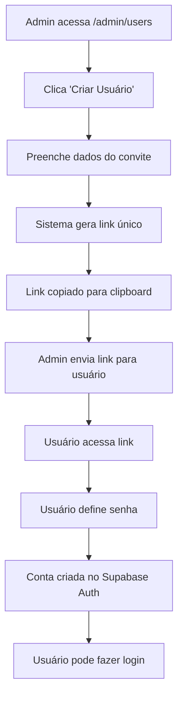

# 🎯 Finalização do Sistema de Gestão de Usuários Admin

## ✅ Status Atual
- ✅ Interface de admin criada (`/components/admin-user-management.tsx`)
- ✅ Página de aceitar convite criada (`/app/accept-invitation/page.tsx`) 
- ✅ Página admin simplificada (`/app/admin/users/page.tsx`)
- ✅ Script SQL base executado (`admin_user_management.sql`)
- ❌ **Triggers e RLS pendentes de execução**

## 🚀 Próximo Passo OBRIGATÓRIO

### 1. Executar o Script Completo (CORRIGIDO)

Agora você precisa executar o arquivo **`scripts/admin_system_complete_fixed.sql`** no **SQL Editor do Supabase** que contém:

- 📋 **Sistema base**: Tabelas e funções principais (sem caracteres especiais)
- 🔄 **Triggers automáticas**: Criação automática de perfil (sem duplicação)
- 🛡️ **RLS Policies**: Controle de acesso baseado em roles
- 🔐 **Integração Auth**: Vincula convites ao Supabase Auth

**Como fazer:**
1. Abra o [Supabase Dashboard](https://supabase.com/dashboard)
2. Vá para **SQL Editor** 
3. Clique em **New Query**
4. Copie e cole TODO o conteúdo do arquivo `scripts/admin_system_complete_fixed.sql`
5. Clique em **Run** (▶️)

> ✅ **CORRIGIDO**: Removidos caracteres especiais e erro de trigger duplicado

### 2. Verificar se funcionou

Após executar o SQL, você deve ver várias mensagens de sucesso, incluindo:
```
🎉 SISTEMA COMPLETO DE GESTÃO DE USUÁRIOS CONFIGURADO COM SUCESSO!
```

### 3. Testar o Sistema

1. **Acesse**: `http://localhost:3000/admin/users`
2. **Clique em**: "Criar Usuário" 
3. **Preencha** os dados do novo usuário
4. **Clique em**: "Criar Convite"
5. **Resultado**: Link do convite será copiado para área de transferência

### 4. Testar Aceitar Convite

1. **Cole o link** em nova aba do navegador
2. **Defina uma senha** para o novo usuário  
3. **Clique em**: "Aceitar Convite e Criar Conta"
4. **Resultado**: 
   - ✨ Usuário criado automaticamente no Supabase Auth
   - 🗂️ Perfil criado automaticamente na tabela `user_profiles`
   - 🔐 Permissões aplicadas baseadas no role
   - 📝 Ação registrada no log de auditoria

### 5. Verificar Integração Completa

Após aceitar um convite, verifique:

1. **Supabase Auth**: Usuário aparece em Authentication → Users
2. **Perfil criado**: Dados aparecem na tabela `user_profiles`
3. **Permissões funcionando**: Usuário consegue fazer login e acessar apenas o que deveria
4. **Logs de auditoria**: Ações registradas na tabela `admin_actions`

## 🎯 O que o Sistema Faz

### ✨ Para o Admin:
- **Cria convites** sem acesso ao Supabase
- **Gerencia usuários** direto pelo dashboard
- **Monitora convites** pendentes e expirados
- **Controla permissões** por role e agência

### 🔗 Para o Usuário Convidado:
- **Recebe link** único e seguro
- **Define senha** própria
- **Conta criada automaticamente** no Supabase Auth
- **Pode fazer login** normalmente

## 🛡️ Recursos de Segurança e Automação

### 🔥 **NOVO**: Triggers Automáticas
- ✅ **Criação automática de perfil**: Quando usuário aceita convite, perfil é criado automaticamente
- ✅ **Integração com Supabase Auth**: Vincula convites aos usuários reais do sistema
- ✅ **Log automático**: Registra todas as ações de criação de usuário

### 🛡️ **NOVO**: RLS Policies Inteligentes
- ✅ **Admin global**: Vê e gerencia todos os convites
- ✅ **Agency Owner**: Vê e gerencia apenas convites da sua agência
- ✅ **Agency Staff**: Vê convites da sua agência (somente leitura)
- ✅ **Cliente**: Sem acesso ao sistema de convites

### 🔐 **NOVO**: Verificação de Permissões
- ✅ **Função `get_current_user_permissions()`**: Verifica automaticamente o que cada usuário pode fazer
- ✅ **Controle granular**: Diferentes níveis de acesso baseados no role
- ✅ **Segurança total**: Impossível burlar permissões via API

### 🔧 **NOVO**: Funções Atualizadas
- ✅ **`create_user_invitation()`**: Agora usa `auth.uid()` do usuário logado
- ✅ **`get_pending_invitations()`**: Respeita RLS e mostra apenas convites permitidos
- ✅ **`cleanup_expired_invitations()`**: Função de manutenção automática

## 🛡️ Recursos de Segurança Básicos

- ✅ **Links únicos** com UUID
- ✅ **Expiração** em 7 dias
- ✅ **Verificação de permissões** (RLS)
- ✅ **Auditoria completa** de ações
- ✅ **Criptografia** de senhas temporárias

## 📊 Tabelas Criadas

1. **`user_invitations`**: Gerencia convites pendentes
2. **`admin_actions`**: Log de todas as ações administrativas

## 🔧 Funções Criadas

1. **`create_user_invitation()`**: Cria convite para novo usuário
2. **`accept_user_invitation()`**: Aceita convite e cria conta
3. **`get_pending_invitations()`**: Lista convites pendentes 
4. **`cancel_invitation()`**: Cancela convite pendente

## ⚡ Benefícios

### ❌ ANTES (Problema):
- Admin precisa acessar Supabase Dashboard
- Criar usuário manualmente no Auth
- Passar credenciais por email/WhatsApp
- Sem controle de expiração
- Sem auditoria

### ✅ DEPOIS (Solução):
- Admin cria usuários pelo próprio dashboard
- Link seguro com expiração
- Usuário define própria senha
- Auditoria completa
- **Zero acesso ao Supabase necessário!**

## 🚨 IMPORTANTE

**Este sistema resolve o problema principal identificado pelo usuário:**

> *"e como que a pessoa (nosso cliente), dono de agencia vai comprar o acesso ao site se o cadastro só é feito pelo site do supabase?"*

**Agora NÃO é mais necessário criar usuários manualmente no Supabase!** 

Todo o processo é automatizado:
1. **Admin cria convite** → Link gerado
2. **Usuário aceita convite** → Conta criada automaticamente
3. **Usuário faz login** → Sistema funcionando

---

## 🔄 Fluxo Completo



**Execute o SQL e teste! O sistema está completo e pronto para uso! 🚀**
