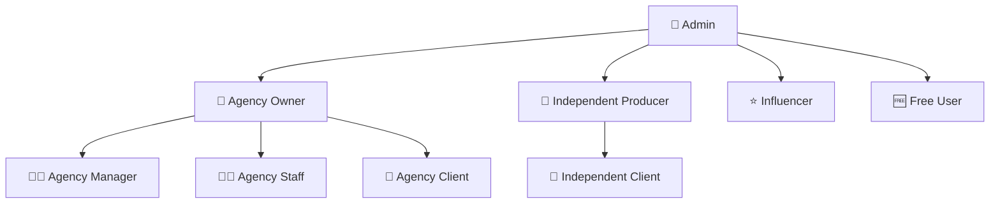

# 🎯 FVStudios Dashboard

**Plataforma SaaS completa para agências de marketing digital e produtores independentes**

Sistema multi-tenant com autenticação robusta, permissões granulares, gestão de equipes e monetização integrada via Stripe.

---

## 🚀 Visão Geral

O **FVStudios Dashboard** é uma solução completa que permite:

- 🏢 **Agências** gerenciarem múltiplos clientes e equipes colaborativas
- 🎯 **Produtores Independentes** controlarem seus projetos  
- 👥 **Clientes** acompanharem resultados e relatórios
- 💰 **Sistema de Vendas** automatizado com Stripe
- 📊 **Analytics** integrados e dashboard em tempo real
- 🤝 **Gestão de Equipes** com convites e criação direta de usuários

## 🎭 Sistema de Usuários (9 Roles)



| Role | Descrição | Dashboard | Permissões Especiais |
|------|-----------|-----------|---------------------|
| 👑 **admin** | Administrador global | `/admin` | Acesso total ao sistema |
| 🏢 **agency_owner** | Proprietário de agência | `/agency` | Gestão completa + financeiro |
| 👨‍💼 **agency_manager** | Gerente de agência | `/agency` | Gestão de equipe sem financeiro |
| 👨‍💻 **agency_staff** | Funcionário de agência | `/agency` | Acesso limitado aos projetos |
| 🤝 **agency_client** | Cliente de agência | `/client` | Visualização de seus projetos |
| 🎯 **independent_producer** | Produtor independente | `/independent` | Gestão própria de clientes |
| 🤝 **independent_client** | Cliente de produtor | `/client` | Visualização de projetos |
| ⭐ **influencer** | Influenciador digital | `/influencer` | Dashboard de campanhas |
| 🆓 **free_user** | Usuário gratuito | `/dashboard` | Funcionalidades básicas |

## 🤝 Sistema de Gestão de Equipes (NOVO!)

### **Duas Modalidades de Adição de Colaboradores:**

#### 🎯 **Criação Direta**
- Criação **imediata** de usuário com senha
- Acesso **instantâneo** ao sistema
- Ideal para onboarding rápido

#### ✉️ **Sistema de Convites**
- Envio de **link de convite** por email
- Usuário cria **própria senha** ao aceitar
- Rastreamento de convites pendentes/aceitos
- Expiração automática em 7 dias

### **Interface de Gestão:**
- 🔄 **Toggle dinâmico** entre modos
- 📝 **Formulário unificado** com campos condicionais
- 👥 **Dashboard de equipe** com estatísticas
- 🎨 **UI responsiva** com indicadores visuais

### **Fluxo de Convites:**
1. **Envio:** `/agency` → Botão "+ Colaborador" → Modo convite
2. **Aceitação:** Email → Link → `/accept-invite?token=UUID`
3. **Validação:** Token, expiração, dados do convite
4. **Criação:** Usuário define senha → Conta ativa
5. **Redirecionamento:** Login automático

## 💳 Sistema de Planos e Monetização

### 📋 **Planos para Agências**
| Plano | Colaboradores | Projetos | Clientes | Recursos | Mensal |
|-------|---------------|----------|----------|----------|--------|
| **Basic** | 5 usuários | 10 projetos | 10 clientes | Dashboard básico | R$ 199 |
| **Pro** | 15 usuários | 50 projetos | 50 clientes | Analytics + Automação | R$ 499 |
| **Enterprise** | Ilimitado | Ilimitado | Ilimitado | White-label + API | R$ 999 |

### 🎯 **Planos para Independentes**
| Plano | Projetos | Clientes | IA & Automação | Analytics | Mensal |
|-------|----------|----------|----------------|-----------|--------|
| **Starter** | 3 | 5 | ❌ | Básico | R$ 49 |
| **Professional** | 15 | 25 | ✅ | Avançado | R$ 149 |
| **Expert** | 50 | 100 | ✅ Premium | Completo | R$ 299 |

## 🛠️ Stack Tecnológica

### **Frontend**
- ⚡ **Next.js 15.4.2** com App Router
- 🎨 **TailwindCSS** + **shadcn/ui**
- 🌙 **Dark/Light Mode** com next-themes
- 📱 **Design Responsivo** mobile-first
- 🔄 **React Hooks** para estado global

### **Backend & Database**
- 🐘 **Supabase** (PostgreSQL + Auth + RLS)
- 🔐 **Row Level Security** para multi-tenancy
- 🔑 **JWT Authentication** com refresh tokens
- 📊 **Real-time subscriptions**
- 🔄 **Database Functions** para lógica de negócio

### **Integrations**
- 💳 **Stripe** (pagamentos + webhooks)
- 📧 **Email Services** (convites de equipe)
- 📊 **Analytics APIs** (Google, Meta, LinkedIn)
- 🔗 **Webhooks** para automação

## 🚀 Instalação e Setup

### **1. Pré-requisitos**
```bash
# Versões necessárias
Node.js >= 18.0.0
npm >= 9.0.0 ou pnpm >= 8.0.0
```

### **2. Clone e Instalação**
```bash
git clone https://github.com/fvstudios/dashboard.git
cd fvstudiosdash
pnpm install
```

### **3. Configuração do Ambiente**
```bash
# Copiar arquivo de exemplo
cp .env.example .env.local

# Configurar variáveis (obrigatórias)
NEXT_PUBLIC_SUPABASE_URL=https://seu-projeto.supabase.co
NEXT_PUBLIC_SUPABASE_ANON_KEY=sua_anon_key
SUPABASE_SERVICE_ROLE_KEY=sua_service_role_key
STRIPE_SECRET_KEY=sk_test_...
STRIPE_WEBHOOK_SECRET=whsec_...
```

### **4. Setup do Banco de Dados**
```sql
-- Execute no SQL Editor do Supabase:
-- Copie e cole todo o conteúdo do arquivo:
scripts/PRODUCTION_SETUP.sql

-- ⚠️ IMPORTANTE: Altere o email/senha do admin antes de executar!
```

### **4.1 Correção de Problemas de API (Se Necessário)**
Se após a instalação você encontrar erros 500 nas APIs de projetos/tarefas:
```sql
-- Execute para corrigir foreign keys faltando:
scripts/FIX_API_ERRORS_CORRECTED.sql
```

### **5. Inicialização**
```bash
# Desenvolvimento
pnpm dev

# Produção
pnpm build
pnpm start
```

### **6. Primeiro Acesso**
```
URL: http://localhost:3000/login
Email: admin@fvstudios.com (o que você configurou)
Senha: admin123456 (a que você configurou)
```

## 📁 Estrutura do Projeto

```
fvstudiosdash/
├── 📁 app/                     # Next.js App Router
│   ├── 📁 (auth)/             # Rotas de autenticação
│   ├── 📁 admin/              # Dashboard admin
│   ├── 📁 agency/             # Dashboard agência
│   ├── 📁 accept-invite/      # Sistema de convites
│   └── 📁 api/                # API Routes
├── 📁 components/             # Componentes React
│   ├── 📁 ui/                 # shadcn/ui components
│   ├── 📄 agency-dashboard.tsx # Dashboard principal
│   └── 📄 team-management.tsx  # Gestão de equipes
├── 📁 hooks/                  # Custom hooks
├── 📁 lib/                    # Utilities e configurações
├── 📁 scripts/               # Scripts de banco
│   └── 📄 PRODUCTION_SETUP.sql # Setup completo
└── 📁 types/                 # TypeScript definitions
```

## 🔐 Sistema de Segurança

### **Row Level Security (RLS)**
- ✅ **Isolamento de dados** por agência/usuário
- ✅ **Políticas granulares** por tabela e operação
- ✅ **Funções helper** para verificação de permissões
- ✅ **Auditoria** de acessos e modificações

### **Autenticação**
- 🔑 **JWT Tokens** com refresh automático
- 🔐 **Senhas criptografadas** (bcrypt)
- 🛡️ **Rate limiting** em endpoints sensíveis
- 🔒 **Session management** seguro

## 📊 Features Implementadas

### ✅ **Core System**
- [x] Sistema de autenticação completo
- [x] Dashboard multi-role com permissões
- [x] Gestão de projetos e tarefas
- [x] Sistema de usuários e perfis
- [x] Tema escuro/claro responsivo

### ✅ **Team Collaboration (NOVO!)**
- [x] Criação direta de colaboradores
- [x] Sistema de convites por email
- [x] Dashboard de gestão de equipe
- [x] Controle de permissões por role
- [x] Interface unificada com toggle

### ✅ **Business Logic**
- [x] Integração Stripe (pagamentos + webhooks)
- [x] Sistema de leads do website
- [x] Processamento de assinaturas
- [x] Multi-tenancy com isolamento de dados

### 🔄 **Em Desenvolvimento**
- [ ] Sistema de analytics completo
- [ ] Automações com IA
- [ ] White-label para agências
- [ ] API externa para integrações
- [ ] Mobile app (React Native)

## 🧪 Comandos de Desenvolvimento

```bash
# Desenvolvimento
pnpm dev                    # Inicia servidor dev
pnpm build                  # Build de produção
pnpm start                  # Servidor produção
pnpm lint                   # ESLint check
pnpm type-check            # TypeScript check

# Database
pnpm db:reset              # Reset completo do DB
pnpm db:seed               # Dados de exemplo
pnpm db:migrate            # Migrações pendentes
```

## 🤝 Como Contribuir

1. **Fork** o repositório
2. **Crie** uma branch para sua feature (`git checkout -b feature/nova-feature`)
3. **Commit** suas mudanças (`git commit -m 'feat: adiciona nova feature'`)
4. **Push** para a branch (`git push origin feature/nova-feature`)
5. **Abra** um Pull Request

### **Padrões de Commit**
```
feat: nova funcionalidade
fix: correção de bug
docs: atualização de documentação
style: formatação, sem mudança de lógica
refactor: refatoração de código
test: adição/correção de testes
chore: tarefas de manutenção
```

## 📞 Suporte e Contato

- 🌐 **Website:** [fvstudios.com.br](https://fvstudios.com.br)
- 📧 **Email:** contato@fvstudios.com.br
- 💬 **Discord:** [Discord FVStudios](https://discord.gg/fvstudios)
- 📱 **WhatsApp:** +55 (11) 99999-9999

## 📜 Licença

Este projeto está licenciado sob a **MIT License** - veja o arquivo [LICENSE](LICENSE) para detalhes.

---

## 🎉 Status do Projeto

### **Versão Atual: 2.1.0** 
- ✅ **Sistema base** completamente funcional
- ✅ **Gestão de equipes** implementada
- ✅ **Interface moderna** com shadcn/ui
- ✅ **Multi-tenancy** com RLS
- ✅ **Integração Stripe** operacional
- ✅ **APIs corrigidas** (foreign keys de projetos/tarefas)
- ✅ **Scripts de diagnóstico** para troubleshooting
- 🔄 **Analytics** em desenvolvimento

### **Próximas Releases:**
- **v2.2.0** - Sistema de analytics completo
- **v2.3.0** - Automações com IA
- **v3.0.0** - Mobile app + API externa

---

**Desenvolvido com ❤️ pela equipe FVStudios**

*Transformando ideias em resultados digitais extraordinários*