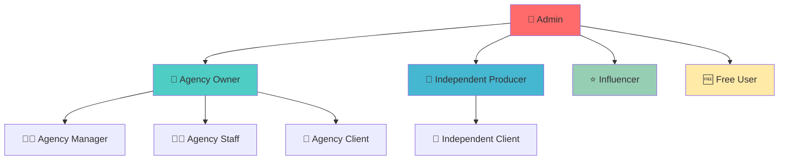

# 🎯 FVStudios Dashboard

**Plataforma SaaS completa para agências de marketing digital, produtores independentes e influenciadores**

Sistema multi-tenant com autenticação robusta, permissões granulares, gestão de equipes, integração com APIs externas e monetização integrada via Stripe.

[](https://nextjs.org/)
[](https://www.typescriptlang.org/)
[](https://supabase.com/)
[](https://tailwindcss.com/)

---

## 🚀 Recursos Principais

### 🏢 **Multi-Tenant Avançado**
- **9 tipos de usuários** com permissões granulares
- **Isolamento completo** de dados por cliente
- **Gestão de equipes** com convites e criação direta

### 🔗 **Integrações de API**
- **Meta Ads** (Facebook/Instagram)
- **Google Ads** 
- **TikTok Ads**
- **LinkedIn Ads**
- **RD Station** (CRM/Email Marketing)
- **Buffer** (Social Media)
- **Criptografia AES-256** para tokens
- **Validação automática** e renovação de tokens

### 🎛️ **Sistema Inteligente**
- **Recomendações IA** para tarefas
- **Análise preditiva** de prazos
- **Automação inteligente** de projetos
- **Templates com IA**
- **Assistente de otimização** de recursos

### 💰 **Monetização**
- **Integração Stripe** completa
- **Planos flexíveis** (Gratuito, Básico, Pro, Enterprise)
- **Cobrança automática**
- **Gestão de assinaturas**

---

## 🎭 Hierarquia de Usuários



| Role | Descrição | Dashboard | Integrações API |
|------|-----------|-----------|-----------------|
| 👑 **admin** | Administrador global | `/admin` | ✅ Todas (visão global) |
| 🏢 **agency_owner** | Proprietário de agência | `/agency` | ✅ Clientes da agência |
| 👨‍💼 **agency_manager** | Gerente de agência | `/agency` | ✅ Clientes da agência |
| 👨‍💻 **agency_staff** | Funcionário de agência | `/agency` | 👁️ Visualização apenas |
| 🤝 **agency_client** | Cliente de agência | `/client` | ✅ Próprias integrações |
| 🎯 **independent_producer** | Produtor independente | `/independent` | ✅ Próprias integrações |
| 🤝 **independent_client** | Cliente de produtor | `/client` | ✅ Próprias integrações |
| ⭐ **influencer** | Influenciador digital | `/influencer` | ✅ Próprias integrações |
| 🆓 **free_user** | Usuário gratuito | `/dashboard` | ✅ Próprias integrações |

---

## 🛠️ Instalação Rápida

### **Pré-requisitos**
- Node.js 18+
- PostgreSQL (ou Supabase)
- Conta Stripe (para pagamentos)

### **1. Clone o Repositório**
```bash
git clone https://github.com/yourusername/fvstudiosdash.git
cd fvstudiosdash
npm install
```

### **2. Configuração do Banco de Dados**
```bash
# Execute a migração completa
psql $DATABASE_URL -f database/COMPLETE_MIGRATION.sql

# Ou use o Supabase
npx supabase db reset
```

### **3. Variáveis de Ambiente**
```bash
cp .env.example .env.local
```

Configure as variáveis obrigatórias:
```env
# Supabase
NEXT_PUBLIC_SUPABASE_URL=your_supabase_url
NEXT_PUBLIC_SUPABASE_ANON_KEY=your_supabase_anon_key

# Stripe
STRIPE_SECRET_KEY=sk_test_...
NEXT_PUBLIC_STRIPE_PUBLISHABLE_KEY=pk_test_...

# APIs Externas
META_CLIENT_ID=your_meta_client_id
META_CLIENT_SECRET=your_meta_client_secret
GOOGLE_CLIENT_ID=your_google_client_id
GOOGLE_CLIENT_SECRET=your_google_client_secret
TIKTOK_CLIENT_KEY=your_tiktok_client_key
TIKTOK_CLIENT_SECRET=your_tiktok_client_secret
LINKEDIN_CLIENT_ID=your_linkedin_client_id
LINKEDIN_CLIENT_SECRET=your_linkedin_client_secret

# Criptografia
ENCRYPTION_MASTER_KEY=your_64_char_hex_key
```

### **4. Executar o Projeto**
```bash
npm run dev
```

Acesse: `http://localhost:3000`

---

## 📁 Estrutura do Projeto

```
fvstudiosdash/
├── 📱 app/                          # Next.js App Router
│   ├── 🔐 api/                      # API Routes
│   │   ├── api-integrations/        # Gestão de integrações
│   │   ├── oauth/                   # Fluxos OAuth
│   │   └── webhooks/                # Webhooks de terceiros
│   ├── 👑 admin/                    # Painel administrativo
│   ├── 🏢 agency/                   # Dashboard agências
│   ├── 📱 social-media/             # Integrações sociais
│   └── 🎯 [outros dashboards]/
├── 🧩 components/                   # Componentes React
│   ├── ui/                          # Componentes base
│   ├── api-integrations.tsx         # Interface de integrações
│   └── sidebar.tsx                  # Navegação principal
├── 🗄️ database/                     # Scripts de banco
│   ├── COMPLETE_MIGRATION.sql       # Migração completa
│   └── schemas/                     # Schemas organizados
├── 📚 lib/                          # Utilitários
│   ├── encryption.ts                # Criptografia de tokens
│   ├── api-validators.ts            # Validação de APIs
│   └── job-scheduler.ts             # Jobs automáticos
├── 📖 docs/                         # Documentação
└── 🔧 scripts/                      # Scripts de manutenção
```

---

## 🔗 Integrações de API

### **Configuração de Integrações**

O sistema permite que cada **cliente individual** configure suas próprias integrações com total **isolamento de dados**.

#### **Providers Suportados:**

| Provider | Tipo | OAuth 2.0 | Recursos |
|----------|------|-----------|----------|
| 🔵 **Meta Ads** | Ads | ✅ | Campanhas FB/IG, Insights, Gestão de Anúncios |
| 🔴 **Google Ads** | Ads | ✅ | Campanhas Search/Display, Relatórios, Keywords |
| ⚫ **TikTok Ads** | Ads | ✅ | Campanhas TikTok, Criativos, Métricas |
| 🔵 **LinkedIn Ads** | Ads | ✅ | Campanhas B2B, Lead Gen, Targeting |
| 🟠 **RD Station** | CRM | ✅ | Leads, Email Marketing, Automação |
| 🟡 **Buffer** | Social | ✅ | Agendamento Posts, Analytics |

#### **Segurança das Integrações:**
- 🔐 **Criptografia AES-256-GCM** para todos os tokens
- 🔄 **Renovação automática** de tokens expirados
- 📊 **Logs detalhados** de todas as requisições
- 🛡️ **Row Level Security** no banco de dados

### **Como Configurar:**

1. **Acesse**: `/social-media/api-integrations`
2. **Clique** em "Conectar" no provider desejado
3. **Autorize** o acesso via OAuth
4. **Configure** as preferências de sincronização

---

## 🎛️ Sistema Inteligente

### **IA e Automação**

O FVStudios possui um sistema inteligente integrado que oferece:

#### **1. Recomendações Inteligentes**
- Sugestão de tarefas baseada no histórico
- Identificação de gargalos de produção
- Otimização de prazos automaticamente

#### **2. Análise Preditiva**
- Previsão de atrasos em projetos
- Estimativa de conclusão baseada em dados históricos
- Alertas proativos de riscos

#### **3. Assistente IA**
- Otimização de alocação de recursos
- Sugestões de melhoria de processos
- Análise de performance da equipe

#### **4. Automação Inteligente**
- Templates dinâmicos que se adaptam
- Criação automática de projetos recorrentes
- Workflows inteligentes

#### **5. Central de Templates IA**
- Templates que aprendem com o uso
- Sugestões personalizadas por tipo de projeto
- Otimização contínua de processos

---

## 🔐 Segurança e Permissões

### **Sistema de Autenticação**
- **Supabase Auth** com email/senha
- **Row Level Security (RLS)** em todas as tabelas
- **Policies** granulares por role
- **JWT tokens** seguros

### **Isolamento de Dados**
- **Multi-tenancy** com isolamento total
- **Client-specific data** - cada cliente vê apenas seus dados
- **Agency-level isolation** - agências não veem dados umas das outras
- **Admin oversight** - admins têm visão global quando necessário

### **Criptografia**
- **AES-256-GCM** para dados sensíveis
- **PBKDF2** para derivação de chaves
- **Salt** únicos por registro
- **Master key** gerenciada via variáveis de ambiente

---

## 💰 Sistema de Monetização

### **Integração Stripe**
- **Assinaturas recorrentes**
- **Múltiplos planos** (Free, Basic, Pro, Enterprise)
- **Upgrade/downgrade** automático
- **Webhooks** para sincronização de status

### **Planos Disponíveis**
| Plano | Preço | Usuários | Integrações | Recursos Especiais |
|-------|-------|----------|-------------|-------------------|
| 🆓 **Free** | R$ 0/mês | 1 | 2 | Recursos básicos |
| 📋 **Basic** | R$ 97/mês | 5 | 5 | Relatórios avançados |
| 🚀 **Pro** | R$ 197/mês | 15 | Ilimitadas | IA + Automação |
| 🏢 **Enterprise** | R$ 497/mês | Ilimitados | Ilimitadas | Tudo + Suporte prioritário |

---

## 📊 Analytics e Relatórios

### **Dashboard em Tempo Real**
- **KPIs principais** atualizados automaticamente
- **Gráficos interativos** com Chart.js/D3.js
- **Filtros avançados** por período, cliente, projeto

### **Relatórios Disponíveis**
- 📈 **Performance de Campanhas** (ROI, CPC, CTR)
- 👥 **Gestão de Equipe** (produtividade, tarefas)
- 💰 **Financeiro** (receitas, custos, margens)
- 📱 **Social Media** (engajamento, alcance)
- 🎯 **Conversões** (leads, vendas, funil)

---

## 🔧 Scripts de Manutenção

### **Comandos Úteis**
```bash
# Reset completo do banco (desenvolvimento)
npm run db:reset

# Migração completa
npm run db:migrate

# Executar apenas sistema inteligente
npm run db:intelligent

# Verificar integridade
npm run db:check

# Backup
npm run db:backup
```

### **Scripts SQL Disponíveis**
- `database/COMPLETE_MIGRATION.sql` - Migração completa do zero
- `database/INTELLIGENT_SYSTEM.sql` - Apenas sistema inteligente
- `database/API_INTEGRATIONS.sql` - Apenas integrações de API
- `scripts/DIAGNOSTIC.sql` - Verificação do sistema

---

## 🚀 Deploy e Produção

### **Vercel (Recomendado)**
```bash
npm run build
npx vercel --prod
```

### **Docker**
```bash
docker build -t fvstudios-dashboard .
docker run -p 3000:3000 fvstudios-dashboard
```

### **Variáveis de Produção**
```env
NODE_ENV=production
NEXTAUTH_URL=https://yourdomain.com
NEXTAUTH_SECRET=your_secret_key
DATABASE_URL=postgresql://...
ENABLE_JOB_SCHEDULER=true
```

---

## 📚 Documentação Adicional

- 📖 [**Guia de Instalação Completo**](docs/INSTALLATION.md)
- 🔐 [**Arquitetura de Segurança**](docs/SECURITY.md)
- 🔗 [**Guia de Integrações API**](docs/API_INTEGRATIONS.md)
- 🤖 [**Sistema Inteligente**](docs/INTELLIGENT_SYSTEM.md)
- 🎭 [**Gestão de Usuários**](docs/USER_MANAGEMENT.md)
- 💰 [**Sistema de Vendas**](docs/SALES_SYSTEM.md)

---

## 🤝 Contribuição

1. **Fork** o projeto
2. **Crie** uma branch para sua feature (`git checkout -b feature/AmazingFeature`)
3. **Commit** suas mudanças (`git commit -m 'Add some AmazingFeature'`)
4. **Push** para a branch (`git push origin feature/AmazingFeature`)
5. **Abra** um Pull Request

---

## 📄 Licença

Este projeto está sob a licença MIT. Veja o arquivo [LICENSE](LICENSE) para mais detalhes.

---

## 📞 Suporte

- 📧 **Email**: suporte@fvstudios.com.br
- 💬 **Discord**: [FVStudios Community](https://discord.gg/fvstudios)
- 📖 **Documentação**: [docs.fvstudios.com.br](https://docs.fvstudios.com.br)
- 🐛 **Issues**: [GitHub Issues](https://github.com/yourusername/fvstudiosdash/issues)

---

**⭐ Se este projeto te ajudou, deixe uma star no GitHub!**

*Desenvolvido com ❤️ pela equipe FVStudios*