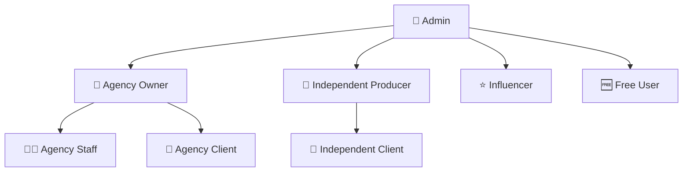

# 🎯 FVStudios Dashboard

**Plataforma SaaS completa para agências de marketing digital e produtores independentes**

Sistema multi-tenant com autenticação robusta, permissões granulares e monetização integrada.

---

## 🚀 Visão Geral

O **FVStudios Dashboard** é uma solução completa que permite:

- 🏢 **Agências** gerenciarem múltiplos clientes e equipes
- 🎯 **Produtores Independentes** controlarem seus projetos  
- 👥 **Clientes** acompanharem resultados e relatórios
- 💰 **Sistema de Vendas** automatizado com Stripe/PagSeguro
- 📊 **Analytics** integrados (Google, Facebook, LinkedIn Ads)

## 🎭 Sistema de Usuários (8 Roles)



| Role | Descrição | Dashboard |
|------|-----------|-----------|
| 👑 **admin** | Administrador global | `/admin` |
| 🏢 **agency_owner** | Proprietário de agência | `/agency` |
| 👨‍💼 **agency_staff** | Funcionário de agência | `/agency` |
| 🤝 **agency_client** | Cliente de agência | `/client` |
| 🎯 **independent_producer** | Produtor independente | `/independent` |
| 🤝 **independent_client** | Cliente de produtor | `/client` |
| ⭐ **influencer** | Influenciador digital | `/influencer` |
| 🆓 **free_user** | Usuário gratuito | `/dashboard` |

## 💳 Planos e Monetização

| Plano | Tipo | Clientes | Projetos | Recursos | Preço/mês |
|-------|------|----------|----------|----------|-----------|
| **Free** | Individual | 1 | 3 | Google Analytics | R$ 0 |
| **Basic** | Individual | 5 | 20 | + Google/Facebook Ads | R$ 99 |
| **Premium** | Individual | 25 | 100 | + LinkedIn + Automação | R$ 299 |
| **Enterprise** | Individual | ∞ | ∞ | Todas as integrações | R$ 999 |
| **Agency Basic** | Agência | 50 | 200 | Multi-cliente + White-label | R$ 499 |
| **Agency Pro** | Agência | 200 | 1000 | + API + Automação avançada | R$ 1299 |

### 🛒 Sistema de Vendas Automatizado

1. **Landing page** `/agency-signup` para captação
2. **Checkout** integrado Stripe/PagSeguro  
3. **Webhook** cria agência automaticamente pós-pagamento
4. **Onboarding** guiado para configuração inicial
5. **Cobrança recorrente** automática

## 🏗️ Arquitetura Técnica

### 🔧 Stack Principal:
- **Frontend:** Next.js 15 + React 18 + TypeScript
- **Backend:** Supabase (PostgreSQL + Auth + RLS)
- **Styling:** Tailwind CSS + Shadcn/ui
- **Pagamentos:** Stripe + PagSeguro
- **Deploy:** Vercel

### 🗄️ Banco de Dados:
- **user_profiles** - Usuários multi-role
- **agencies** - Agências (multi-tenant)
- **projects** - Campanhas e projetos
- **agency_leads** - Sistema de vendas
- **agency_subscriptions** - Assinaturas
- **invoices** - Faturas e cobrança

### 🔐 Segurança (RLS):
```sql
-- Row Level Security otimizado
-- Isolamento total por tenant
-- Políticas sem recursão infinita
-- Admin bypass por UUID específico
```

## 📦 Setup e Instalação

### 1. **Clone e Instale**
```bash
git clone https://github.com/fvstudios/dashboard.git
cd dashboard
pnpm install
```

### 2. **Configurar Ambiente**
```env
# .env.local
NEXT_PUBLIC_SUPABASE_URL=https://xxx.supabase.co
NEXT_PUBLIC_SUPABASE_ANON_KEY=eyJ...
SUPABASE_SERVICE_ROLE_KEY=eyJ...

# Para vendas (opcional)
STRIPE_PUBLIC_KEY=pk_test_...
STRIPE_SECRET_KEY=sk_test_...
```

### 3. **Setup do Banco**
Execute no Supabase SQL Editor:
```sql
-- 1. Criação principal
\i scripts/setup_direto.sql

-- 2. Usuário admin  
\i scripts/create_admin_user.sql

-- 3. Sistema de vendas (opcional)
\i scripts/sales_system.sql
```

### 4. **Executar**
```bash
pnpm dev
```

### 5. **Primeiro Login**
```
URL: http://localhost:3000/login
Email: admin@fvstudios.com  
Senha: [configurada no Supabase Auth]
Redirecionamento: /admin
```

## 🎨 Funcionalidades

### 📊 **Analytics Integrados**
- Google Analytics 4
- Google Ads API  
- Facebook Ads API
- LinkedIn Ads API
- Métricas em tempo real

### 👥 **CRM Completo**
- Gestão de clientes
- Histórico de interações
- Pipeline de vendas
- Segmentação avançada

### 📋 **Gestão de Projetos**
- Kanban board interativo
- Timeline e milestones  
- Controle de orçamento
- Relatórios de performance

### 📅 **Calendário**
- Agendamento de reuniões
- Prazos e deadlines
- Integração Google Calendar
- Notificações automáticas

### 💬 **Comunicação**
- Chat interno por projeto
- Notificações em tempo real
- Comentários e anotações
- Sistema de aprovações

### 📈 **Relatórios**
- Dashboards personalizados
- Exportação automática
- Agendamento de relatórios
- White-label (marca própria)

## 🛠️ Scripts de Desenvolvimento

```bash
pnpm dev          # Servidor desenvolvimento
pnpm build        # Build produção  
pnpm start        # Servidor produção
pnpm lint         # Verificar código
pnpm typecheck    # Verificar tipos
```

## 📁 Estrutura do Projeto

```
fvstudiosdash/
├── app/                    # App Router (Next.js 15)
│   ├── admin/             # Dashboard administrativo
│   ├── agency/            # Dashboard agência  
│   ├── independent/       # Dashboard produtor
│   ├── client/            # Dashboard cliente
│   ├── agency-signup/     # Landing page vendas
│   └── api/               # API routes
├── components/            # Componentes UI
├── lib/                   # Utilitários
├── scripts/               # Scripts SQL
├── types/                 # TypeScript definitions
└── supabase/              # Configurações DB
```

## 🔄 Fluxo de Trabalho

### Para **Agências:**
1. Cadastro via `/agency-signup`
2. Pagamento Stripe/PagSeguro
3. Criação automática pós-pagamento  
4. Onboarding guiado
5. Adicionar equipe e clientes
6. Gerenciar projetos multi-cliente

### Para **Produtores Independentes:**
1. Cadastro manual pelo admin
2. Dashboard próprio `/independent`
3. Gestão de clientes diretos
4. Relatórios personalizados

### Para **Clientes:**
1. Convite da agência/produtor
2. Dashboard restrito `/client`  
3. Visualização de resultados
4. Comunicação com equipe

## 📊 Monitoramento e Analytics

- **📈 Métricas de Uso:** Supabase Analytics
- **💰 Receita:** Stripe Dashboard
- **🎯 Conversão:** Google Analytics 4
- **🚨 Erros:** Sentry (opcional)
- **📧 Email:** SendGrid/Mailgun

## 🚀 Deploy e Produção

### **Vercel (Recomendado):**
```bash
# Deploy automático
git push origin main

# Variáveis de produção
vercel env add NEXT_PUBLIC_SUPABASE_URL
vercel env add SUPABASE_SERVICE_ROLE_KEY
# ... outras variáveis
```

### **Configurações Produção:**
- **Domain:** dashboard.fvstudios.com
- **CDN:** Vercel Edge Network  
- **SSL:** Automático
- **Analytics:** Vercel Analytics

## 📞 Suporte e Documentação

### 📚 **Documentos Disponíveis:**
- ✅ **SISTEMA-FVSTUDIOS-COMPLETO.md** - Documentação completa
- ✅ **INSTRUCOES_RECRIACAO.md** - Setup do banco
- ✅ **SISTEMA-VENDAS.md** - Sistema de monetização
- ✅ **RESUMO-FINAL.md** - Resumo técnico

### 🎯 **Scripts Principais:**
- **setup_direto.sql** - Criação completa do banco
- **create_admin_user.sql** - Usuário administrador
- **sales_system.sql** - Sistema de vendas

### 📱 **Contato:**
- 📧 **Email:** suporte@fvstudios.com
- 💬 **Discord:** [FVStudios Community](https://discord.gg/fvstudios)
- 📱 **WhatsApp:** +55 (11) 99999-9999

## 📄 Licença

MIT License - veja [LICENSE](LICENSE) para detalhes.

---

## 🏆 Resultado Final

✨ **Sistema SaaS Completo** pronto para escalar
🔒 **Segurança Enterprise** com RLS otimizado
💰 **Monetização Automática** via Stripe/PagSeguro
🎯 **Multi-tenant** com isolamento total
🚀 **Performance** otimizada com Next.js 15

**Desenvolvido com ❤️ por [FVStudios](https://fvstudios.com)**