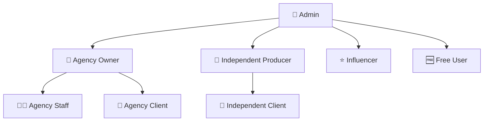

# 🎯 FVStudios Dashboard - Sistema Completo Finalizado

## 🚀 Visão Geral

O **FVStudios Dashboard** é uma plataforma completa de gerenciamento multi-tenant para **agências de marketing digital** e **produtores independentes**, com sistema integrado de vendas e autenticação robusta.

---

## 🏗️ Arquitetura do Sistema

### 🎭 Hierarquia de Usuários (8 Roles)



#### Descrição dos Roles:

1. **👑 admin** - Administrador do sistema (acesso total)
2. **🏢 agency_owner** - Proprietário de agência (gerencia equipe e clientes)
3. **👨‍💼 agency_staff** - Funcionário de agência (executa campanhas)
4. **🤝 agency_client** - Cliente de agência (visualiza relatórios)
5. **🎯 independent_producer** - Produtor independente (freelancer/consultor)
6. **🤝 independent_client** - Cliente de produtor independente
7. **⭐ influencer** - Influenciador digital
8. **🆓 free_user** - Usuário gratuito (limitado)

---

## 💳 Sistema de Planos e Monetização

### 📋 Planos Disponíveis:

| Plano | Usuários | Clientes | Projetos | Recursos | Preço |
|-------|----------|----------|----------|-----------|-------|
| **Free** | Individual | 1 | 3 | Google Analytics | R$ 0 |
| **Basic** | Individual | 5 | 20 | + Google/Facebook Ads | R$ 99/mês |
| **Premium** | Individual | 25 | 100 | + LinkedIn + Automação | R$ 299/mês |
| **Enterprise** | Individual | Ilimitado | Ilimitado | Todas as integrações | R$ 999/mês |
| **Agency Basic** | Agência | 50 | 200 | Multi-cliente + White-label | R$ 499/mês |
| **Agency Pro** | Agência | 200 | 1000 | + API + Automação avançada | R$ 1299/mês |

### 🛒 Sistema de Vendas Automatizado

**Fluxo Completo:**
1. **Lead** acessa `/agency-signup`
2. **Escolhe plano** e preenche dados
3. **Redirecionamento** para checkout Stripe/PagSeguro
4. **Pagamento aprovado** → **Webhook** ativa automação
5. **Agência criada** automaticamente no banco
6. **Usuário admin** criado no Supabase Auth
7. **Email de boas-vindas** + dados de acesso
8. **Onboarding guiado** para configuração inicial

---

## 🗄️ Estrutura do Banco de Dados

### Tabelas Principais:

#### 👥 **user_profiles**
```sql
CREATE TABLE user_profiles (
  id UUID REFERENCES auth.users(id) PRIMARY KEY,
  email VARCHAR(255) UNIQUE NOT NULL,
  name VARCHAR(255) NOT NULL,
  role VARCHAR(50) DEFAULT 'free_user',
  agency_id UUID,
  company VARCHAR(255),
  subscription_plan VARCHAR(50) DEFAULT 'free',
  subscription_status VARCHAR(20) DEFAULT 'active',
  created_at TIMESTAMP DEFAULT now()
);
```

#### 🏢 **agencies** (para sistema multi-tenant)
```sql
CREATE TABLE agencies (
  id UUID PRIMARY KEY DEFAULT uuid_generate_v4(),
  name VARCHAR(255) NOT NULL,
  email VARCHAR(255) UNIQUE NOT NULL,
  subscription_plan VARCHAR(50) DEFAULT 'agency_basic',
  subscription_status VARCHAR(20) DEFAULT 'active',
  created_at TIMESTAMP DEFAULT now()
);
```

#### 💼 **projects** (campanhas e projetos)
```sql
CREATE TABLE projects (
  id UUID PRIMARY KEY DEFAULT uuid_generate_v4(),
  title VARCHAR(255) NOT NULL,
  client_id UUID REFERENCES user_profiles(id),
  agency_id UUID REFERENCES agencies(id),
  status VARCHAR(50) DEFAULT 'active',
  budget DECIMAL(12,2),
  deadline TIMESTAMP,
  created_at TIMESTAMP DEFAULT now()
);
```

#### 💰 **Sistema de Vendas** (5 tabelas adicionais)
- `agency_leads` - Leads interessados
- `agency_subscriptions` - Assinaturas ativas
- `invoices` - Histórico de faturas
- `discount_coupons` - Cupons de desconto
- `agency_onboarding` - Processo de integração

---

## 🔐 Sistema de Segurança (RLS)

### Row Level Security Implementado:

```sql
-- Usuários podem ver próprio perfil
CREATE POLICY "Users can view own profile" 
ON user_profiles FOR SELECT 
USING (auth.uid() = id);

-- Admin tem acesso total (SEM RECURSÃO)
CREATE POLICY "Admin full access" 
ON user_profiles FOR ALL 
USING (auth.uid() = '71f0cbbb-1963-430c-b445-78907e747574'::uuid);

-- Agência pode gerenciar próprios clientes
CREATE POLICY "Agency can manage clients" 
ON user_profiles FOR ALL 
USING (agency_id IN (
  SELECT agency_id FROM user_profiles 
  WHERE id = auth.uid() AND role IN ('agency_owner', 'agency_staff')
));
```

**Principais Características:**
- ✅ **Isolamento total** por tenant (agência/produtor)
- ✅ **Políticas otimizadas** sem recursão infinita
- ✅ **Admin bypass** por UUID específico
- ✅ **Permissões granulares** por role

---

## 🛠️ Configuração e Deploy

### 1. **Banco de Dados**

Execute os scripts na ordem:

```sql
-- 1. Limpeza e recreação
scripts/setup_direto.sql

-- 2. Criar usuário admin
scripts/create_admin_user.sql

-- 3. Sistema de vendas (opcional)
scripts/sales_system.sql
```

### 2. **Variáveis de Ambiente**

```env
# Supabase
NEXT_PUBLIC_SUPABASE_URL=https://xxx.supabase.co
NEXT_PUBLIC_SUPABASE_ANON_KEY=eyJ...
SUPABASE_SERVICE_ROLE_KEY=eyJ...

# Stripe (para vendas)
STRIPE_PUBLIC_KEY=pk_test_...
STRIPE_SECRET_KEY=sk_test_...
STRIPE_WEBHOOK_SECRET=whsec_...

# URLs
NEXT_PUBLIC_URL=https://dashboard.fvstudios.com
```

### 3. **Primeiro Login**

```
Email: admin@fvstudios.com
Senha: [senha definida no Supabase Auth]
URL: /login → redirecionamento automático para /admin
```

---

## 📱 Páginas e Funcionalidades

### 🏠 Dashboards por Role:

- **`/admin`** - Dashboard administrativo completo
- **`/agency`** - Dashboard de agência (multi-cliente)
- **`/independent`** - Dashboard de produtor independente
- **`/influencer`** - Dashboard de influenciador
- **`/client`** - Dashboard de cliente (relatórios)
- **`/dashboard`** - Dashboard básico (free users)

### 🛒 Sistema de Vendas:

- **`/agency-signup`** - Landing page pública para cadastro
- **`/onboarding`** - Processo guiado pós-pagamento
- **`/upgrade-plan`** - Upgrade de planos

### ⚙️ Funcionalidades:

- **📊 Analytics** - Integração com Google/Facebook/LinkedIn Ads
- **📅 Calendário** - Agendamento e gestão de eventos
- **👥 CRM** - Gestão de clientes e contatos  
- **📋 Projetos** - Kanban board e timeline
- **💬 Chat** - Comunicação interna
- **📈 Relatórios** - Dashboards personalizados
- **🔔 Notificações** - Sistema de alertas
- **🎨 White-label** - Marca personalizada (planos agency)

---

## 🚀 Tecnologias Utilizadas

### Frontend:
- **Next.js 15** (App Router)
- **React 18** + TypeScript
- **Tailwind CSS** + Shadcn/ui
- **Recharts** (gráficos)
- **Framer Motion** (animações)

### Backend:
- **Supabase** (Auth + Database + RLS)
- **PostgreSQL** (banco principal)
- **Stripe** (pagamentos)
- **Vercel** (deploy)

### Integrações:
- **Google Analytics API**
- **Google Ads API**
- **Facebook Ads API**
- **LinkedIn Ads API**
- **SendGrid** (emails)

---

## 🎯 Próximos Passos

### ✅ Concluído:
- ✅ Sistema de autenticação multi-role
- ✅ Banco de dados com RLS otimizado
- ✅ Dashboard administrativo
- ✅ Sistema de permissões granular
- ✅ Estrutura de vendas automatizada

### 🔄 Em Implementação:
- 🔄 Teste completo de todas as funcionalidades
- 🔄 Integração com APIs de anúncios
- 🔄 Sistema de notificações em tempo real
- 🔄 Relatórios avançados

### 📈 Roadmap Futuro:
- 📱 Aplicativo mobile
- 🤖 IA para otimização de campanhas
- 📊 Business Intelligence avançado
- 🌍 Internacionalização
- 🔌 API pública para integrações

---

## 📞 Suporte e Documentação

### 📚 Documentos Disponíveis:
- ✅ **INSTRUCOES_RECRIACAO.md** - Setup do banco de dados
- ✅ **SISTEMA-VENDAS.md** - Sistema de monetização
- ✅ **RESUMO-FINAL.md** - Resumo técnico

### 🔧 Scripts Principais:
- **`scripts/setup_direto.sql`** - Criação completa do banco
- **`scripts/create_admin_user.sql`** - Usuário administrador  
- **`scripts/sales_system.sql`** - Sistema de vendas

### 🎯 Arquivos de Configuração:
- **`lib/permissions.ts`** - Sistema de permissões
- **`middleware.ts`** - Proteção de rotas
- **`app/login/page.tsx`** - Página de login otimizada

---

## 🏆 Conclusão

O **FVStudios Dashboard** é um sistema completo e robusto que oferece:

✨ **Escalabilidade** - Suporta de 1 usuário a milhares de agências
🔒 **Segurança** - RLS otimizado e isolamento total por tenant  
💰 **Monetização** - Sistema de vendas automático e recorrente
🎯 **Flexibilidade** - 8 tipos de usuário com permissões granulares
🚀 **Performance** - Arquitetura moderna com Next.js 15

**Resultado:** Uma plataforma SaaS completa, pronta para escalar e gerar receita recorrente no mercado de marketing digital brasileiro.