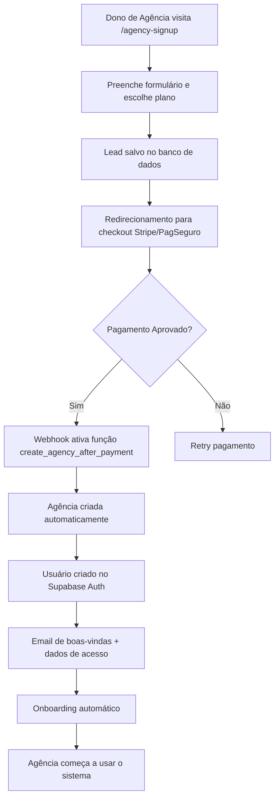

# 💰 Sistema Completo de Vendas para Agências

## 🎯 Visão Geral

Sistema completo que permite donos de agências se cadastrarem e comprarem acesso ao FVStudios Dashboard, com **cadastro automatizado** após aprovação do pagamento.

## 📋 Fluxo de Vendas



## 🗄️ Estrutura do Banco

### Novas Tabelas Criadas:

1. **`agency_leads`** - Leads interessados antes do pagamento
2. **`agency_subscriptions`** - Assinaturas e cobrança
3. **`invoices`** - Histórico de faturas
4. **`discount_coupons`** - Sistema de cupons
5. **`agency_onboarding`** - Processo de integração

## 🚀 Implementação

### 1. Setup do Banco de Dados

Execute no Supabase SQL Editor:

```sql
-- Executar sales_system.sql
-- Adiciona 5 tabelas + funções + políticas RLS
```

### 2. Página de Cadastro Público

**Rota:** `/agency-signup`

**Funcionalidades:**
- ✅ Seleção de planos (Agency Basic/Pro)
- ✅ Toggle mensal/anual com cálculo de economia
- ✅ Formulário completo da agência
- ✅ Resumo do pedido
- ✅ Lead salvo automaticamente no banco

### 3. Integração com Pagamento

#### Stripe (Recomendado)

```typescript
// app/api/create-checkout/route.ts
export async function POST(request: Request) {
  const { plan, cycle, leadId } = await request.json();
  
  const session = await stripe.checkout.sessions.create({
    mode: 'subscription',
    line_items: [{
      price: STRIPE_PRICES[plan][cycle],
      quantity: 1,
    }],
    success_url: `${process.env.NEXT_PUBLIC_URL}/onboarding?session_id={CHECKOUT_SESSION_ID}`,
    cancel_url: `${process.env.NEXT_PUBLIC_URL}/agency-signup`,
    metadata: { leadId, plan, cycle },
    subscription_data: {
      metadata: { leadId, plan, cycle }
    }
  });
  
  return Response.json({ url: session.url });
}
```

#### Webhook do Stripe

```typescript
// app/api/webhooks/stripe/route.ts
export async function POST(request: Request) {
  const sig = request.headers.get('stripe-signature');
  const event = stripe.webhooks.constructEvent(await request.text(), sig, process.env.STRIPE_WEBHOOK_SECRET);
  
  if (event.type === 'checkout.session.completed') {
    const session = event.data.object;
    const { leadId, plan, cycle } = session.metadata;
    
    // Criar agência após pagamento aprovado
    const { data, error } = await supabase.rpc('create_agency_after_payment', {
      lead_email: session.customer_email,
      plan_name: plan,
      billing_cycle: cycle,
      stripe_customer_id: session.customer,
      stripe_subscription_id: session.subscription
    });
    
    if (!error) {
      // Criar usuário no Supabase Auth
      const { data: authUser } = await supabaseAdmin.auth.admin.createUser({
        email: session.customer_email,
        password: generateTempPassword(),
        email_confirm: true,
        user_metadata: { full_name: data.user_name }
      });
      
      // Enviar email de boas-vindas
      await sendWelcomeEmail(session.customer_email, data);
    }
  }
  
  return Response.json({ received: true });
}
```

### 4. Processo de Onboarding

#### Página de Boas-vindas

```typescript
// app/onboarding/page.tsx
export default function OnboardingPage() {
  const steps = [
    'account_created',
    'payment_confirmed', 
    'team_setup',
    'first_client_added',
    'apis_configured',
    'completed'
  ];
  
  // Interface guiada para configuração inicial
  // - Convite para equipe
  // - Adicionar primeiro cliente
  // - Configurar APIs
  // - Tutorial do dashboard
}
```

### 5. Sistema de Cupons

```sql
-- Cupons pré-criados
INSERT INTO discount_coupons (code, discount_type, discount_value, description)
VALUES 
  ('WELCOME30', 'percentage', 30.00, '30% off primeiro mês'),
  ('ANUAL50', 'fixed_amount', 50.00, 'R$ 50 off plano anual'),
  ('LAUNCH25', 'percentage', 25.00, '25% desconto de lançamento');
```

## 📊 Dashboard Administrativo

### Métricas de Vendas

- 📈 Leads por dia/semana/mês
- 💰 Taxa de conversão lead → pagamento
- 📋 Funil de vendas completo
- 🎯 Performance por canal (orgânico, ads, referral)
- 💳 MRR (Monthly Recurring Revenue)
- 👥 Churn rate de agências

### Gestão de Leads

- 📋 Lista de todos os leads
- 🏷️ Status: new → contacted → demo → proposal → closed
- 📞 Histórico de contatos
- 🎯 Atribuição de vendedor responsável

## 🔒 Segurança e RLS

- ✅ **Leads:** Apenas admin pode gerenciar
- ✅ **Assinaturas:** Agência vê apenas própria
- ✅ **Faturas:** Isolamento por agência
- ✅ **Cupons:** Validação automática
- ✅ **Onboarding:** Agência gerencia próprio processo

## 🎨 UX/UI Otimizada

### Landing Page (/agency-signup)
- 🎯 **Comparação clara** entre planos
- 💰 **Economia anual** destacada
- ✨ **Social proof** e depoimentos
- 📱 **Responsivo** e moderno
- ⚡ **Loading states** durante processamento

### Checkout
- 💳 **Stripe Elements** integrado
- 🔒 **SSL/Security badges**
- 💰 **Resumo de cobrança claro**
- 🏷️ **Campo para cupons de desconto**

### Onboarding
- ✅ **Progress bar** visual
- 🎓 **Tutorial interativo**
- 📧 **Emails automáticos** de cada etapa
- 🚀 **Setup assistido** de APIs

## 🔄 Automações

### Email Marketing
- 📧 **Sequência de boas-vindas** (7 emails)
- 📊 **Relatórios de uso** semanais
- 🎯 **Tips de otimização** mensais
- 🔔 **Alertas de cobrança** automáticos

### Notificações Internas
- 🆕 **Novo lead** → Slack/Teams
- 💰 **Pagamento aprovado** → Celebração
- ❌ **Falha no pagamento** → Retry automático
- 📊 **Métricas diárias** → Dashboard admin

## 💡 Próximos Passos

1. **Execute `sales_system.sql`** para criar as tabelas
2. **Configure Stripe/PagSeguro** com as chaves de API
3. **Implemente webhooks** para automação pós-pagamento
4. **Teste o fluxo completo** com cartões de teste
5. **Configure emails transacionais** (SendGrid/Mailgun)
6. **Adicione analytics** (Google Analytics/Mixpanel)

## 🔧 Configurações Necessárias

### Variáveis de Ambiente

```env
# Stripe
STRIPE_PUBLIC_KEY=pk_test_...
STRIPE_SECRET_KEY=sk_test_...
STRIPE_WEBHOOK_SECRET=whsec_...

# PagSeguro (Alternativo)
PAGSEGURO_EMAIL=seu@email.com
PAGSEGURO_TOKEN=...
PAGSEGURO_APP_ID=...

# Email
SENDGRID_API_KEY=...
FROM_EMAIL=noreply@fvstudios.com

# URLs
NEXT_PUBLIC_URL=https://dashboard.fvstudios.com
ADMIN_URL=https://admin.fvstudios.com
```

---

## ✨ Resultado Final

Com essa implementação, você terá:

- 🎯 **Landing page profissional** para capturar leads
- 💳 **Sistema de pagamento automático** 
- 🏢 **Criação automática** de agências pós-pagamento
- 👥 **Onboarding guiado** para novos usuários  
- 📊 **Dashboard administrativo** para gestão de vendas
- 🔄 **Automações completas** de email e notificações

**Não há mais necessidade de criar usuários manualmente no Supabase!** Tudo é automatizado após o pagamento ser aprovado.
