# 🚀 Expansão da Plataforma FVStudios - Integração com APIs Modernas e n8n

Análise completa da arquitetura atual e proposta de expansão com integração de APIs modernas, fluxo n8n e agentes de IA.

---

## 📊 **Análise da Arquitetura Atual**

### **Stack Tecnológico Existente**
- **Frontend**: Next.js 15.4.2 + TypeScript + Tailwind CSS + Shadcn/ui
- **Backend**: Next.js API Routes + Supabase PostgreSQL
- **Auth**: Supabase Auth com RLS
- **Criptografia**: AES-256-GCM para tokens
- **Sistema Multi-tenant**: Isolamento completo por cliente
- **9 Roles**: admin, agency_owner, agency_manager, agency_staff, agency_client, independent_producer, independent_client, influencer, free_user

### **Funcionalidades Atuais**
✅ **Dashboard Inteligente** com IA integrada  
✅ **Sistema de Projetos e Tarefas** com Kanban  
✅ **Integrações API** (Meta Ads, Google Ads, TikTok Ads, LinkedIn Ads)  
✅ **Sistema de Notificações** em tempo real  
✅ **Automação Inteligente** com templates  
✅ **Análise Preditiva** e recomendações  
✅ **Multi-tenancy** com isolamento total  
✅ **Monetização Stripe** com planos flexíveis  

---

## 🎯 **APIs Modernas Sugeridas para Expansão**

### **🎨 Design e Criação de Conteúdo**

#### **Canva API** (Prioridade Alta)
```typescript
interface CanvaIntegration {
  provider: 'canva'
  endpoints: {
    designs: '/v1/designs'
    templates: '/v1/templates'
    folders: '/v1/folders'
    brands: '/v1/brands'
    uploads: '/v1/uploads'
  }
  features: [
    'template_access',
    'design_creation',
    'brand_management',
    'team_collaboration',
    'asset_management'
  ]
  pricing: 'Enterprise Plan'
}
```

#### **Adobe Creative SDK** (Futuro)
- Photoshop API para edição avançada
- Illustrator API para vetores
- After Effects API para vídeos

#### **Figma API**
- Designs colaborativos
- Protótipos interativos
- Design system management

### **🤖 Inteligência Artificial**

#### **OpenAI GPT-4** (Implementação Imediata)
```typescript
interface OpenAIIntegration {
  models: ['gpt-4-turbo', 'gpt-4-vision', 'dall-e-3']
  use_cases: [
    'content_generation',
    'campaign_analysis',  
    'creative_briefing',
    'image_generation',
    'code_generation'
  ]
  integration_points: [
    'intelligent_workstation',
    'project_wizard',
    'content_creation',
    'automation_engine'
  ]
}
```

#### **Claude API (Anthropic)**
```typescript
interface ClaudeIntegration {
  models: ['claude-3-opus', 'claude-3-sonnet']
  specialties: [
    'analysis',
    'reasoning',
    'document_processing',
    'strategic_planning'
  ]
}
```

#### **Cohere API**
- Embeddings para busca semântica
- Classification para categorização automática
- Generation para conteúdo multilíngue

### **📱 Comunicação e Automação**

#### **WhatsApp Business API** (Crítico para Fluxo)
```typescript
interface WhatsAppIntegration {
  provider: 'whatsapp_business'
  features: [
    'message_sending',
    'media_sharing',
    'template_messages',
    'webhook_support',
    'conversation_management'
  ]
  flow_integration: 'initial_briefing_collection'
}
```

#### **Slack API**
```typescript
interface SlackIntegration {
  features: [
    'team_notifications',
    'project_updates',
    'approval_workflows',
    'file_sharing',
    'bot_interactions'
  ]
}
```

#### **Twilio**
- SMS notifications
- Voice calls para aprovações
- Video conferencing

### **📊 Analytics Avançados**

#### **Google Analytics 4**
```typescript
interface GA4Integration {
  features: [
    'website_tracking',
    'conversion_tracking',
    'audience_insights',
    'attribution_modeling',
    'predictive_metrics'
  ]
}
```

#### **Mixpanel**
```typescript
interface MixpanelIntegration {
  features: [
    'event_tracking',
    'funnel_analysis',
    'cohort_analysis',
    'a_b_testing',
    'retention_analysis'
  ]
}
```

### **🔄 CRM e Sales**

#### **HubSpot CRM**
```typescript
interface HubSpotIntegration {
  features: [
    'contact_management',
    'deal_pipeline',
    'email_marketing',
    'workflow_automation',
    'reporting_dashboard'
  ]
}
```

#### **Pipedrive**
```typescript
interface PipedriveIntegration {
  features: [
    'sales_pipeline',
    'activity_tracking',
    'email_integration',
    'mobile_app',
    'reporting'
  ]
}
```

### **⏰ Produtividade**

#### **Calendly API**
```typescript
interface CalendlyIntegration {
  features: [
    'meeting_scheduling',
    'availability_management',
    'calendar_sync',
    'automated_reminders',
    'meeting_analytics'
  ]
}
```

#### **Notion API**
```typescript
interface NotionIntegration {
  features: [
    'document_management',
    'knowledge_base',
    'project_documentation',
    'team_collaboration',
    'database_integration'
  ]
}
```

#### **ClickUp API**
```typescript
interface ClickUpIntegration {
  features: [
    'task_management',
    'time_tracking',
    'goal_setting',
    'reporting',
    'team_collaboration'
  ]
}
```

---

## 🔄 **Fluxo Completo n8n com Agentes de IA**

### **Arquitetura do Fluxo Inteligente**

```mermaid
graph TD
    A[📱 WhatsApp Initial Contact] --> B[🤖 AI Briefing Agent]
    B --> C[📊 Analysis & Diagnosis Agent]
    C --> D[🎯 Planning Agent]
    D --> E[⚙️ Internal Process Engine]
    E --> F[📅 Content Scheduling Agent]
    F --> G[🎨 Production Agent]
    G --> H[✏️ Content Creation Agent]
    H --> I[✅ Approval Interface]
    I --> J[🔧 Adjustment Agent]
    J --> K[🚀 Campaign Launch Agent]
    K --> L[📈 Performance Monitoring]
    L --> M[📊 Final Reports Agent]
```



### **1. Atendimento Initial via WhatsApp + IA**

#### **n8n Workflow: Cliente Initial**
```json
{
  "name": "WhatsApp_Initial_Briefing",
  "nodes": [
    {
      "name": "WhatsApp Trigger",
      "type": "n8n-nodes-base.webhook",
      "parameters": {
        "httpMethod": "POST",
        "path": "whatsapp-webhook"
      }
    },
    {
      "name": "OpenAI Briefing Agent",
      "type": "n8n-nodes-base.openAi",
      "parameters": {
        "model": "gpt-4-turbo",
        "prompt": "Você é um especialista em briefing de marketing digital. Colete as seguintes informações do cliente: 1) Objetivo da campanha 2) Público-alvo 3) Orçamento disponível 4) Prazo desejado 5) Plataformas de interesse. Faça perguntas naturais e amigáveis."
      }
    },
    {
      "name": "Save to Supabase",
      "type": "n8n-nodes-base.supabase",
      "parameters": {
        "table": "client_briefings",
        "operation": "insert"
      }
    }
  ]
}
```

### **2. Análise e Diagnóstico Automático**

#### **Claude Analysis Agent**
```typescript
interface AnalysisAgent {
  name: "Campaign_Analysis_Agent"
  model: "claude-3-opus"
  inputs: [
    "client_briefing",
    "market_data", 
    "competitor_analysis",
    "budget_constraints"
  ]
  outputs: [
    "campaign_strategy",
    "recommended_platforms",
    "budget_allocation",
    "timeline_estimate",
    "risk_assessment"
  ]
}
```

### **3. Planejamento de Execução com IA**

#### **Project Planning Agent**
```json
{
  "name": "AI_Project_Planner",
  "agent": "gpt-4-turbo",
  "parameters": {
    "system_prompt": "Você é um gerente de projetos especializado em marketing digital. Com base no briefing e análise, crie um roadmap detalhado com:",
    "required_outputs": [
      "project_phases",
      "task_breakdown",
      "resource_allocation", 
      "milestone_definitions",
      "deliverable_specifications"
    ]
  }
}
```

### **4. Desenvolvimento dos Processos Internos**

#### **Internal Process Engine**
```typescript
interface ProcessEngine {
  triggers: [
    'project_approved',
    'milestone_reached',
    'approval_received'
  ]
  actions: [
    'create_supabase_project',
    'assign_team_members',
    'setup_slack_channels',
    'configure_calendly_meetings',
    'initialize_canva_workspace'
  ]
}
```

### **5. Agendamento de Produções**

#### **Content Scheduling Workflow**
```json
{
  "name": "Content_Production_Scheduler",
  "nodes": [
    {
      "name": "Calendar Analysis",
      "type": "n8n-nodes-base.googleCalendar",
      "operation": "getAll"
    },
    {
      "name": "AI Optimal Scheduling",
      "type": "n8n-nodes-base.openAi",
      "parameters": {
        "prompt": "Analise a disponibilidade da equipe e otimize o cronograma de produção considerando: 1) Prazos do cliente 2) Carga de trabalho atual 3) Dependências entre tarefas 4) Tempo de aprovação estimado"
      }
    },
    {
      "name": "Calendly Integration",
      "type": "n8n-nodes-base.calendly",
      "operation": "createEvent"
    },
    {
      "name": "Slack Notifications",
      "type": "n8n-nodes-base.slack",
      "operation": "postMessage"
    }
  ]
}
```

### **6. Execução das Produções**

#### **Production Execution Agent**
```typescript
interface ProductionAgent {
  capabilities: [
    'canva_template_selection',
    'ai_content_generation', 
    'brand_compliance_check',
    'quality_assurance',
    'delivery_preparation'
  ]
  integrations: [
    'canva_api',
    'openai_dall_e',
    'supabase_storage',
    'slack_notifications'
  ]
}
```

### **7. Criação e Edição de Conteúdo**

#### **Content Creation Workflow**
```json
{
  "name": "AI_Content_Creator",
  "workflow": [
    {
      "step": "template_selection",
      "service": "canva_api",
      "ai_assist": "gpt-4-vision"
    },
    {
      "step": "content_generation", 
      "service": "openai_gpt4",
      "parameters": {
        "style_guide": "brand_voice",
        "target_audience": "from_briefing",
        "call_to_action": "campaign_objective"
      }
    },
    {
      "step": "visual_creation",
      "service": "dall_e_3",
      "fallback": "canva_templates"
    },
    {
      "step": "compliance_check",
      "service": "claude_analysis",
      "checks": ["brand_guidelines", "platform_requirements", "legal_compliance"]
    }
  ]
}
```

### **8. Fase de Aprovação**

#### **Approval Interface Workflow**
```typescript
interface ApprovalSystem {
  interface: "streamlined_web_app"
  features: [
    'side_by_side_comparison',
    'inline_commenting',
    'approval_buttons',
    'revision_requests',
    'mobile_friendly'
  ]
  notifications: [
    'whatsapp_approval_request',
    'email_with_preview',
    'slack_team_notification'
  ]
  tracking: [
    'approval_time_metrics',
    'revision_count',
    'client_satisfaction'
  ]
}
```

### **9. Ajustes Finais**

#### **Adjustment Agent**
```json
{
  "name": "Smart_Adjustment_Agent",
  "triggers": ["revision_requested"],
  "process": [
    {
      "step": "analyze_feedback",
      "ai": "claude-3-sonnet",
      "action": "extract_actionable_items"
    },
    {
      "step": "generate_solutions",
      "ai": "gpt-4-turbo", 
      "action": "propose_revisions"
    },
    {
      "step": "implement_changes",
      "services": ["canva_api", "openai_api"],
      "validation": "brand_compliance"
    },
    {
      "step": "resubmit_approval",
      "notification": "whatsapp_update"
    }
  ]
}
```

### **10. Gestão de Tráfego e Campanhas**

#### **Campaign Launch Agent**
```typescript
interface CampaignAgent {
  pre_launch: [
    'pixel_verification',
    'audience_setup',
    'budget_allocation',
    'ad_creative_upload',
    'compliance_check'
  ]
  launch: [
    'simultaneous_platform_launch',
    'monitoring_setup',
    'alert_configuration'
  ]
  optimization: [
    'performance_monitoring',
    'auto_bid_adjustment',
    'audience_optimization',
    'creative_rotation'
  ]
}
```

### **11. Relatórios Finais**

#### **Intelligent Reporting System**
```json
{
  "name": "AI_Report_Generator",
  "data_sources": [
    "meta_ads_api",
    "google_ads_api", 
    "tiktok_ads_api",
    "linkedin_ads_api",
    "google_analytics_4",
    "mixpanel"
  ],
  "ai_analysis": {
    "model": "gpt-4-turbo",
    "analysis_types": [
      "performance_insights",
      "audience_behavior",
      "creative_effectiveness", 
      "roi_optimization",
      "future_recommendations"
    ]
  },
  "report_formats": [
    "executive_summary",
    "detailed_analytics",
    "visual_dashboard",
    "video_presentation"
  ]
}
```

---

## 🎨 **Integração Canva na Workstation**

### **Implementação da API Canva**

#### **1. Estrutura de Integração**
```typescript
// lib/canva-integration.ts
export class CanvaAPIManager {
  private baseUrl = 'https://api.canva.com/rest/v1'
  
  async getTemplates(category?: string, tags?: string[]): Promise<CanvaTemplate[]> {
    const params = new URLSearchParams({
      ...(category && { category }),
      ...(tags && { tags: tags.join(',') })
    })
    
    const response = await fetch(`${this.baseUrl}/templates?${params}`, {
      headers: {
        'Authorization': `Bearer ${this.getAccessToken()}`,
        'Content-Type': 'application/json'
      }
    })
    
    return response.json()
  }
  
  async createDesignFromTemplate(templateId: string, customizations: CanvaCustomization): Promise<CanvaDesign> {
    return fetch(`${this.baseUrl}/designs`, {
      method: 'POST',
      headers: {
        'Authorization': `Bearer ${this.getAccessToken()}`,
        'Content-Type': 'application/json'
      },
      body: JSON.stringify({
        template_id: templateId,
        ...customizations
      })
    }).then(r => r.json())
  }
  
  async generateWithAI(prompt: string, brandGuidelines: BrandGuidelines): Promise<CanvaDesign> {
    // Combinar IA do OpenAI com templates do Canva
    const aiSuggestions = await this.generateAISuggestions(prompt, brandGuidelines)
    const bestTemplate = await this.findBestTemplate(aiSuggestions)
    
    return this.createDesignFromTemplate(bestTemplate.id, {
      text_replacements: aiSuggestions.texts,
      color_palette: brandGuidelines.colors,
      font_selections: brandGuidelines.fonts
    })
  }
}
```

#### **2. Componente Workstation Canva**
```typescript
// components/canva-workstation.tsx
export function CanvaWorkstation() {
  const [templates, setTemplates] = useState<CanvaTemplate[]>([])
  const [selectedTemplate, setSelectedTemplate] = useState<CanvaTemplate | null>(null)
  const [aiPrompt, setAiPrompt] = useState('')
  const [brandGuidelines, setBrandGuidelines] = useState<BrandGuidelines>()
  
  const handleAIGeneration = async () => {
    const canva = new CanvaAPIManager()
    const design = await canva.generateWithAI(aiPrompt, brandGuidelines)
    
    // Salvar no projeto atual
    await saveDesignToProject(design)
    toast.success('Design criado com IA e salvo no projeto!')
  }
  
  return (
    <Card className="canva-integration">
      <CardHeader>
        <CardTitle className="flex items-center gap-2">
          <Palette className="h-5 w-5" />
          Canva Design Studio
        </CardTitle>
      </CardHeader>
      <CardContent>
        <Tabs defaultValue="templates">
          <TabsList>
            <TabsTrigger value="templates">Templates</TabsTrigger>
            <TabsTrigger value="ai-create">Criar com IA</TabsTrigger>
            <TabsTrigger value="brand-assets">Brand Assets</TabsTrigger>
          </TabsList>
          
          <TabsContent value="ai-create">
            <div className="space-y-4">
              <textarea
                placeholder="Descreva o design que você precisa..."
                value={aiPrompt}
                onChange={(e) => setAiPrompt(e.target.value)}
                className="w-full p-3 border rounded-lg"
              />
              <Button onClick={handleAIGeneration} className="w-full">
                <Sparkles className="h-4 w-4 mr-2" />
                Gerar Design com IA
              </Button>
            </div>
          </TabsContent>
        </Tabs>
      </CardContent>
    </Card>
  )
}
```

#### **3. Sistema de Versionamento**
```typescript
interface DesignVersion {
  id: string
  design_id: string
  version_number: number
  created_by: string
  created_at: Date
  changes_summary: string
  canva_url: string
  preview_url: string
  status: 'draft' | 'review' | 'approved' | 'published'
}

export class DesignVersionManager {
  async createVersion(designId: string, changes: string): Promise<DesignVersion> {
    // Implementar versionamento com rastreamento de mudanças
  }
  
  async compareVersions(v1: string, v2: string): Promise<VersionComparison> {
    // Comparar versões visualmente
  }
  
  async rollbackToVersion(versionId: string): Promise<void> {
    // Restaurar versão anterior
  }
}
```

---

## 🏗️ **Arquitetura Técnica Expandida**

### **Nova Estrutura de Banco de Dados**

```sql
-- Adicionar às tabelas existentes
CREATE TABLE IF NOT EXISTS n8n_workflows (
    id UUID PRIMARY KEY DEFAULT gen_random_uuid(),
    agency_id UUID NOT NULL REFERENCES agencies(id),
    name VARCHAR(255) NOT NULL,
    workflow_type VARCHAR(100) NOT NULL, -- briefing, production, approval, reporting
    n8n_workflow_id VARCHAR(255) NOT NULL,
    is_active BOOLEAN DEFAULT true,
    configuration JSONB DEFAULT '{}',
    created_at TIMESTAMPTZ DEFAULT NOW()
);

CREATE TABLE IF NOT EXISTS ai_agents (
    id UUID PRIMARY KEY DEFAULT gen_random_uuid(),
    name VARCHAR(255) NOT NULL,
    type VARCHAR(100) NOT NULL, -- briefing, analysis, planning, content, approval
    model VARCHAR(100) NOT NULL, -- gpt-4, claude-3, cohere
    system_prompt TEXT NOT NULL,
    configuration JSONB DEFAULT '{}',
    is_active BOOLEAN DEFAULT true,
    created_at TIMESTAMPTZ DEFAULT NOW()
);

CREATE TABLE IF NOT EXISTS canva_designs (
    id UUID PRIMARY KEY DEFAULT gen_random_uuid(),
    project_id UUID REFERENCES projects(id),
    canva_design_id VARCHAR(255) NOT NULL,
    template_id VARCHAR(255),
    name VARCHAR(255) NOT NULL,
    preview_url TEXT,
    edit_url TEXT,
    download_url TEXT,
    brand_id VARCHAR(255),
    version_number INTEGER DEFAULT 1,
    status VARCHAR(50) DEFAULT 'draft',
    ai_generated BOOLEAN DEFAULT false,
    ai_prompt TEXT,
    created_at TIMESTAMPTZ DEFAULT NOW()
);

CREATE TABLE IF NOT EXISTS workflow_executions (
    id UUID PRIMARY KEY DEFAULT gen_random_uuid(),
    workflow_id UUID REFERENCES n8n_workflows(id),
    project_id UUID REFERENCES projects(id),
    execution_id VARCHAR(255) NOT NULL,
    status VARCHAR(50) NOT NULL, -- running, success, error, stopped
    started_at TIMESTAMPTZ NOT NULL,
    completed_at TIMESTAMPTZ,
    error_message TEXT,
    execution_data JSONB DEFAULT '{}',
    created_at TIMESTAMPTZ DEFAULT NOW()
);
```

### **Configuração n8n**

#### **Docker Compose para n8n**
```yaml
# docker-compose-n8n.yml
version: '3.8'
services:
  n8n:
    image: n8nio/n8n:latest
    restart: always
    ports:
      - "5678:5678"
    environment:
      - N8N_BASIC_AUTH_ACTIVE=true
      - N8N_BASIC_AUTH_USER=admin
      - N8N_BASIC_AUTH_PASSWORD=${N8N_PASSWORD}
      - WEBHOOK_URL=https://n8n.fvstudios.com/
      - GENERIC_TIMEZONE=America/Sao_Paulo
    volumes:
      - n8n_data:/home/node/.n8n
      - ./n8n/custom-nodes:/home/node/.n8n/custom
    networks:
      - fvstudios-network

  n8n-db:
    image: postgres:15
    restart: always
    environment:
      POSTGRES_DB: n8n
      POSTGRES_USER: n8n
      POSTGRES_PASSWORD: ${N8N_DB_PASSWORD}
    volumes:
      - n8n_db_data:/var/lib/postgresql/data
    networks:
      - fvstudios-network

volumes:
  n8n_data:
  n8n_db_data:

networks:
  fvstudios-network:
    driver: bridge
```

### **Integração com Frontend**

#### **Hook para n8n**
```typescript
// hooks/useN8nWorkflows.ts
export function useN8nWorkflows() {
  const executeWorkflow = async (workflowId: string, data: any) => {
    const response = await fetch(`/api/n8n/execute`, {
      method: 'POST',
      headers: { 'Content-Type': 'application/json' },
      body: JSON.stringify({ workflowId, data })
    })
    return response.json()
  }
  
  const getWorkflowStatus = async (executionId: string) => {
    const response = await fetch(`/api/n8n/status/${executionId}`)
    return response.json()
  }
  
  return { executeWorkflow, getWorkflowStatus }
}
```

#### **API Route para n8n**
```typescript
// app/api/n8n/execute/route.ts
import { NextRequest, NextResponse } from 'next/server'

export async function POST(request: NextRequest) {
  const { workflowId, data } = await request.json()
  
  try {
    const n8nResponse = await fetch(`${process.env.N8N_URL}/webhook/${workflowId}`, {
      method: 'POST',
      headers: {
        'Content-Type': 'application/json',
        'Authorization': `Bearer ${process.env.N8N_API_KEY}`
      },
      body: JSON.stringify(data)
    })
    
    const result = await n8nResponse.json()
    
    // Salvar execução no banco
    await supabase.from('workflow_executions').insert({
      workflow_id: workflowId,
      execution_id: result.executionId,
      status: 'running',
      started_at: new Date().toISOString(),
      execution_data: data
    })
    
    return NextResponse.json(result)
  } catch (error) {
    return NextResponse.json({ error: 'Erro ao executar workflow' }, { status: 500 })
  }
}
```

---

## 📋 **Cronograma de Implementação**

### **Fase 1: Fundação (2-3 meses)**
1. **Semana 1-2**: Setup n8n e infraestrutura
2. **Semana 3-4**: Integração WhatsApp Business API
3. **Semana 5-6**: Integração OpenAI/Claude para briefing
4. **Semana 7-8**: Sistema básico de análise e diagnóstico
5. **Semana 9-10**: Interface de aprovação streamlined
6. **Semana 11-12**: Testes e refinamentos

### **Fase 2: Expansão (2-3 meses)**
1. **Semana 1-2**: Integração Canva API completa
2. **Semana 3-4**: Sistema de versionamento e colaboração
3. **Semana 5-6**: Integrações CRM (HubSpot, Pipedrive)
4. **Semana 7-8**: Analytics avançados (GA4, Mixpanel)
5. **Semana 9-10**: Automação de campanhas
6. **Semana 11-12**: Relatórios inteligentes

### **Fase 3: Otimização (1-2 meses)**
1. **Semana 1-2**: Otimizações de performance
2. **Semana 3-4**: Inteligência preditiva avançada
3. **Semana 5-6**: Mobile apps e PWA
4. **Semana 7-8**: Testes de carga e produção

---

## 💰 **Impacto Comercial Estimado**

### **Novos Streams de Receita**
- **Add-on IA**: +R$ 50-100/mês por usuário
- **Canva Enterprise**: +R$ 30/mês por usuário  
- **Automação Avançada**: +R$ 200/mês por agência
- **Relatórios Premium**: +R$ 100/mês por agência
- **WhatsApp Business**: +R$ 0,05 por mensagem

### **Redução de Custos Operacionais**
- **Automação de Briefing**: -70% tempo manual
- **Criação de Conteúdo**: -50% tempo de produção  
- **Processo de Aprovação**: -60% ciclo de revisão
- **Relatórios**: -80% tempo de preparação

### **ROI Projetado**
- **Investimento Total**: R$ 150,000 - R$ 200,000
- **Receita Adicional Anual**: R$ 500,000 - R$ 800,000
- **ROI**: 250-400% no primeiro ano

---

Esta expansão transformará o FVStudios em uma plataforma de marketing digital completamente automatizada e inteligente, posicionando-a como líder em inovação no mercado brasileiro.