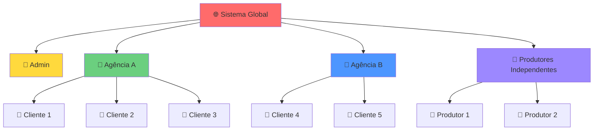

# 🔐 Arquitetura de Segurança - FVStudios Dashboard

Este documento detalha toda a arquitetura de segurança implementada no FVStudios Dashboard, incluindo autenticação, autorização, criptografia e isolamento de dados.

---

## 🎯 Visão Geral da Segurança

O FVStudios Dashboard implementa **múltiplas camadas de segurança** para garantir:

- 🔒 **Isolamento total** de dados entre clientes
- 🛡️ **Criptografia forte** para dados sensíveis
- 🎭 **Controle granular** de permissões
- 🔐 **Autenticação robusta** com Supabase Auth
- 📊 **Auditoria completa** de todas as ações

---

## 🏗️ Arquitetura de Multi-Tenancy

### **Modelo Híbrido de Isolamento**



### **Princípios de Isolamento**

1. **Isolamento por Cliente (Client-Level)**:
   - Cada cliente vê apenas seus próprios dados
   - Integrações de API isoladas por `client_id`
   - Campanhas e posts separados por proprietário

2. **Isolamento por Agência (Agency-Level)**:
   - Agências têm visibilidade dos clientes
   - Staff da agência não vê dados de outras agências
   - Estrutura hierárquica de permissões

3. **Visibilidade Administrativa**:
   - Admins têm acesso global quando necessário
   - Logs de todas as ações administrativas
   - Controle de auditoria centralizado

---

## 🎭 Sistema de Roles e Permissões

### **Hierarquia de Roles**

| Role | Nível | Acesso | Limitações |
|------|-------|--------|------------|
| 👑 **admin** | Sistema | Global | Auditado |
| 🏢 **agency_owner** | Agência | Clientes da agência | Financeiro próprio |
| 👨‍💼 **agency_manager** | Agência | Clientes da agência | Sem acesso financeiro |
| 👨‍💻 **agency_staff** | Agência | Projetos atribuídos | Apenas visualização |
| 🤝 **agency_client** | Cliente | Próprios dados | Isolamento total |
| 🎯 **independent_producer** | Independente | Próprios clientes | Isolamento total |
| 🤝 **independent_client** | Cliente | Próprios dados | Isolamento total |
| ⭐ **influencer** | Independente | Próprios dados | Funcionalidades específicas |
| 🆓 **free_user** | Básico | Próprios dados | Limitações de plano |

### **Matriz de Permissões**

#### **Gestão de Usuários**
| Ação | admin | agency_owner | agency_manager | agency_staff | Outros |
|------|-------|--------------|---------------|--------------|--------|
| Criar usuários | ✅ | ✅ (agência) | ✅ (agência) | ❌ | ❌ |
| Editar perfis | ✅ | ✅ (agência) | ✅ (agência) | 👁️ | ✅ (próprio) |
| Desativar usuários | ✅ | ✅ (agência) | ✅ (agência) | ❌ | ❌ |
| Ver todos os usuários | ✅ | ✅ (agência) | ✅ (agência) | 👁️ (equipe) | ❌ |

#### **Integrações de API**
| Ação | admin | agency_* | Clientes | 
|------|-------|----------|----------|
| Ver todas integrações | ✅ | 👁️ (agência) | ✅ (próprias) |
| Criar integrações | ✅ | ✅ (clientes) | ✅ (próprias) |
| Editar integrações | ✅ | ✅ (clientes) | ✅ (próprias) |
| Deletar integrações | ✅ | ✅ (clientes) | ✅ (próprias) |
| Ver logs detalhados | ✅ | 👁️ (agência) | ✅ (próprias) |

#### **Dados de Campanhas**
| Ação | admin | agency_* | Clientes |
|------|-------|----------|----------|
| Ver campanhas | ✅ | 👁️ (agência) | ✅ (próprias) |
| Gerenciar campanhas | ✅ | ✅ (clientes) | ✅ (próprias) |
| Relatórios avançados | ✅ | ✅ (agência) | ✅ (próprias) |
| Exportar dados | ✅ | ✅ (agência) | ✅ (próprias) |

---

## 🔒 Row Level Security (RLS)

### **Implementação com Supabase**

O sistema utiliza **RLS (Row Level Security)** do PostgreSQL para garantir isolamento a nível de banco de dados.

#### **Política para user_profiles**
```sql
-- Usuários veem apenas seu próprio perfil
CREATE POLICY "Users can view own profile" ON user_profiles
    FOR SELECT USING (auth.uid() = id);

-- Admins veem todos os perfis
CREATE POLICY "Admins can view all profiles" ON user_profiles
    FOR ALL USING (
        EXISTS (
            SELECT 1 FROM user_profiles 
            WHERE id = auth.uid() AND role = 'admin'
        )
    );

-- Staff da agência vê perfis da mesma agência
CREATE POLICY "Agency staff can view agency profiles" ON user_profiles
    FOR SELECT USING (
        agency_id IN (
            SELECT agency_id FROM user_profiles 
            WHERE id = auth.uid() 
            AND role IN ('agency_owner', 'agency_manager', 'agency_staff')
        )
    );
```

#### **Política para api_integrations (Isolamento Total)**
```sql
CREATE POLICY "API integrations access policy" ON api_integrations
    FOR ALL USING (
        -- ADMIN: Acesso total
        EXISTS (
            SELECT 1 FROM user_profiles
            WHERE id = auth.uid() AND role = 'admin'
        )
        OR
        -- CLIENTES: Apenas suas próprias integrações
        (
            client_id = auth.uid()
            AND EXISTS (
                SELECT 1 FROM user_profiles
                WHERE id = auth.uid() 
                AND role IN ('agency_client', 'independent_client', 'independent_producer', 'influencer', 'free_user')
            )
        )
        OR
        -- STAFF AGÊNCIA: Integrações dos clientes da mesma agência
        EXISTS (
            SELECT 1 FROM user_profiles staff, user_profiles client
            WHERE staff.id = auth.uid()
            AND client.id = api_integrations.client_id
            AND staff.agency_id = client.agency_id
            AND staff.role IN ('agency_owner', 'agency_manager', 'agency_staff')
        )
    );
```

### **Vantagens do RLS**

1. **Segurança a Nível de Banco**: Impossível burlar via código
2. **Performance**: Filtros aplicados automaticamente
3. **Auditoria**: Todas as consultas são logadas
4. **Consistência**: Mesmas regras em toda a aplicação

---

## 🔐 Criptografia de Dados Sensíveis

### **Sistema de Criptografia Implementado**

#### **1. Algoritmo Utilizado**
- **AES-256-GCM** para dados sensíveis
- **PBKDF2** para derivação de chaves
- **Salt únicos** para cada registro
- **IV aleatórios** para cada operação

#### **2. Estrutura de Criptografia**

```typescript
// Dados criptografados armazenados como:
interface EncryptedData {
  encryptedData: string  // Dados criptografados (hex)
  iv: string            // Initialization Vector (hex)
  tag: string           // Authentication Tag (hex)
  algorithm: string     // Algoritmo usado
}
```

#### **3. Implementação**

```typescript
export class TokenEncryption {
  // Criptografar dados OAuth completos
  public static encryptOAuthToken(tokenData: {
    access_token: string
    refresh_token?: string
    expires_at?: number
    token_type?: string
    scope?: string
  }): string {
    const tokenString = JSON.stringify(tokenData)
    const encrypted = TokenEncryption.encrypt(tokenString)
    return Buffer.from(JSON.stringify(encrypted)).toString('base64')
  }
  
  // Verificar se token está expirado
  public static isTokenExpired(encryptedToken: string): boolean {
    try {
      const tokenData = TokenEncryption.decryptOAuthToken(encryptedToken)
      if (!tokenData.expires_at) return false
      
      const now = Math.floor(Date.now() / 1000)
      const bufferTime = 300 // 5 minutos de buffer
      
      return tokenData.expires_at < (now + bufferTime)
    } catch (error) {
      return true // Se não conseguir descriptografar, considera expirado
    }
  }
}
```

### **Chaves de Criptografia por Provider**

Para máxima segurança, cada provider tem sua própria chave derivada:

```typescript
export class ProviderKeyManager {
  // Gerar chave específica para cada provider/agência
  private static deriveProviderKey(provider: string, agencyId: string): Buffer {
    const masterKey = TokenEncryption.getMasterKey()
    const salt = `${provider}-${agencyId}-fvstudios`
    
    return crypto.pbkdf2Sync(masterKey, salt, 100000, 32, 'sha512')
  }
}
```

### **Campos Criptografados**

| Tabela | Campo | Conteúdo |
|--------|-------|----------|
| `api_integrations` | `client_secret_encrypted` | OAuth Client Secret |
| `api_integrations` | `access_token_encrypted` | OAuth Access Token + metadados |
| `api_integrations` | `refresh_token_encrypted` | OAuth Refresh Token |
| `api_integrations` | `api_key_encrypted` | API Keys simples |
| `api_webhooks` | `secret_key_encrypted` | Chaves de webhook |

---

## 🔍 Sistema de Auditoria e Logs

### **Logs de Integração**

Todas as requisições para APIs externas são logadas:

```sql
CREATE TABLE integration_logs (
    id UUID PRIMARY KEY,
    integration_id UUID REFERENCES api_integrations(id),
    
    -- Detalhes da requisição
    operation VARCHAR(100) NOT NULL,      -- sync, validate, webhook
    method VARCHAR(10) NOT NULL,          -- GET, POST, PUT, DELETE
    endpoint TEXT NOT NULL,               -- URL chamada
    
    -- Request/Response completos
    request_headers JSONB,
    request_body JSONB,
    response_status INTEGER,
    response_headers JSONB,
    response_body JSONB,
    
    -- Métricas
    duration_ms INTEGER,
    error_message TEXT,
    status VARCHAR(50) NOT NULL,          -- success, error, timeout
    
    created_at TIMESTAMPTZ NOT NULL DEFAULT NOW()
);
```

### **Detecção de Atividade Suspeita**

```typescript
export class SecurityValidation {
  // Detectar tentativas suspeitas
  static detectSuspiciousActivity(logs: any[]): {
    isSuspicious: boolean
    riskLevel: 'low' | 'medium' | 'high'
    alerts: string[]
  } {
    const alerts: string[] = []
    let riskScore = 0

    // Alta taxa de falhas
    const failureRate = failedAttempts / totalAttempts
    if (failureRate > 0.5) {
      alerts.push('Alta taxa de falhas nas requisições')
      riskScore += 30
    }

    // Volume anormal de requisições
    if (recentLogs.length > 100) {
      alerts.push('Volume anormalmente alto de requisições')
      riskScore += 25
    }

    // Múltiplas tentativas de autenticação falharam
    if (authErrors > 5) {
      alerts.push('Múltiplas tentativas de autenticação falharam')
      riskScore += 35
    }

    return {
      isSuspicious: riskScore > 30,
      riskLevel: riskScore >= 60 ? 'high' : riskScore >= 30 ? 'medium' : 'low',
      alerts
    }
  }
}
```

### **Logs de Sistema**

#### **Logs de Acesso**
- Todos os logins e logouts
- Tentativas de acesso negadas
- Mudanças de senha
- Criação/edição de usuários

#### **Logs de Integrações**
- Conexões/desconexões de APIs
- Renovações de token
- Sincronizações de dados
- Erros de API

#### **Logs Administrativos**
- Ações de admins
- Mudanças de configuração
- Criação/edição de agências
- Alterações de planos

---

## 🛡️ Proteções Implementadas

### **1. Proteção contra CSRF**
- Tokens CSRF em todos os formulários
- SameSite cookies
- Verificação de origem

### **2. Proteção contra XSS**
- Sanitização de inputs
- Content Security Policy (CSP)
- Escape de dados na renderização

### **3. Proteção contra SQL Injection**
- Queries parametrizadas
- ORM/Query Builder
- Validação de tipos

### **4. Rate Limiting**
- Limites por IP
- Limites por usuário
- Limites por API endpoint

### **5. Validação de Input**
- Schemas de validação
- Sanitização de dados
- Verificação de tipos

### **6. Proteção de APIs Externas**
- Rate limiting específico por provider
- Retry com backoff exponencial
- Circuit breaker pattern
- Timeout configurável

---

## 🔧 Configurações de Segurança

### **Variáveis de Ambiente Críticas**

```env
# Chave mestra de criptografia (64 caracteres hex)
ENCRYPTION_MASTER_KEY=sua_chave_hex_de_64_caracteres

# Chave de autenticação Next.js
NEXTAUTH_SECRET=sua_chave_secreta_nextauth

# Configurações de segurança
SECURE_COOKIES=true                    # Cookies seguros em produção
HTTPS_ONLY=true                       # Forçar HTTPS
CSRF_PROTECTION=true                  # Proteção CSRF
XSS_PROTECTION=true                   # Proteção XSS

# Rate limiting
RATE_LIMIT_WINDOW=900000              # 15 minutos
RATE_LIMIT_MAX_REQUESTS=100           # 100 requests por janela

# Session security
SESSION_MAX_AGE=86400                 # 24 horas
SESSION_UPDATE_AGE=3600               # Atualizar a cada hora
```

### **Configuração de Headers de Segurança**

```typescript
// next.config.js
const securityHeaders = [
  {
    key: 'X-DNS-Prefetch-Control',
    value: 'on'
  },
  {
    key: 'Strict-Transport-Security',
    value: 'max-age=63072000; includeSubDomains; preload'
  },
  {
    key: 'X-XSS-Protection',
    value: '1; mode=block'
  },
  {
    key: 'X-Frame-Options',
    value: 'DENY'
  },
  {
    key: 'X-Content-Type-Options',
    value: 'nosniff'
  },
  {
    key: 'Referrer-Policy',
    value: 'origin-when-cross-origin'
  },
  {
    key: 'Content-Security-Policy',
    value: "default-src 'self'; script-src 'self' 'unsafe-inline' *.stripe.com; style-src 'self' 'unsafe-inline';"
  }
]
```

---

## 🚨 Incident Response

### **Procedimentos de Emergência**

#### **1. Vazamento de Dados Suspeito**
```bash
# Desabilitar todas as integrações
psql $DATABASE_URL -c "UPDATE api_integrations SET status = 'disabled';"

# Invalidar todas as sessões
psql $DATABASE_URL -c "DELETE FROM auth.sessions;"

# Gerar novo master key
node -e "console.log(require('crypto').randomBytes(32).toString('hex'))"

# Notificar usuários afetados
npm run notify:security-incident
```

#### **2. API Comprometida**
```bash
# Desabilitar provider específico
psql $DATABASE_URL -c "UPDATE api_integrations SET status = 'disabled' WHERE provider = 'meta';"

# Revogar todos os tokens do provider
npm run revoke:tokens --provider=meta

# Notificar clientes afetados
npm run notify:provider-incident --provider=meta
```

#### **3. Acesso Não Autorizado**
```bash
# Bloquear IP suspeito
npm run block:ip --ip=192.168.1.100

# Forçar logout de usuário
npm run force:logout --user=user_id

# Ativar 2FA obrigatório
npm run enforce:2fa --agency=agency_id
```

### **Monitoramento Contínuo**

#### **Alertas Automáticos**
- Taxa de erro > 10% em 5 minutos
- Mais de 50 falhas de login por hora
- Uso de CPU/memória > 80%
- Mais de 1000 requests por minuto de um IP
- Alterações de admin fora do horário comercial

#### **Métricas de Segurança**
- Tempo médio de resposta das APIs
- Taxa de sucesso das integrações
- Número de tokens expirados
- Tentativas de acesso negadas
- Uso de recursos por tenant

---

## 📋 Checklist de Segurança

### **Desenvolvimento**
- [ ] ✅ Todas as variáveis sensíveis em .env
- [ ] ✅ Chaves de criptografia geradas aleatoriamente
- [ ] ✅ HTTPS habilitado (pelo menos em staging)
- [ ] ✅ RLS habilitado em todas as tabelas
- [ ] ✅ Validação de input implementada
- [ ] ✅ Rate limiting configurado
- [ ] ✅ Logs de auditoria funcionando

### **Produção**
- [ ] ✅ Certificados SSL válidos
- [ ] ✅ Headers de segurança configurados
- [ ] ✅ Backup automático do banco
- [ ] ✅ Monitoramento ativo
- [ ] ✅ Plano de incident response
- [ ] ✅ Auditoria de segurança realizada
- [ ] ✅ Penetration testing executado

### **Manutenção**
- [ ] ✅ Rotação regular de chaves
- [ ] ✅ Atualização de dependências
- [ ] ✅ Review de logs de segurança
- [ ] ✅ Teste de backup/restore
- [ ] ✅ Verificação de compliance
- [ ] ✅ Treinamento da equipe

---

## 📞 Contato de Segurança

Para reportar vulnerabilidades de segurança:

- 🔐 **Email**: security@fvstudios.com.br
- 🚨 **Emergência**: +55 11 9999-SEGUR
- 🐛 **Bug Bounty**: [security.fvstudios.com.br](https://security.fvstudios.com.br)

### **Disclosure Responsável**

1. **Reporte** a vulnerabilidade em private
2. **Aguarde** nossa resposta (máximo 48h)
3. **Colabore** conosco na correção
4. **Aguarde** aprovação antes de disclosure público
5. **Receba** reconhecimento no hall of fame

---

**🛡️ A segurança é nossa prioridade máxima!**

*Este documento é atualizado regularmente. Última revisão: 2024*