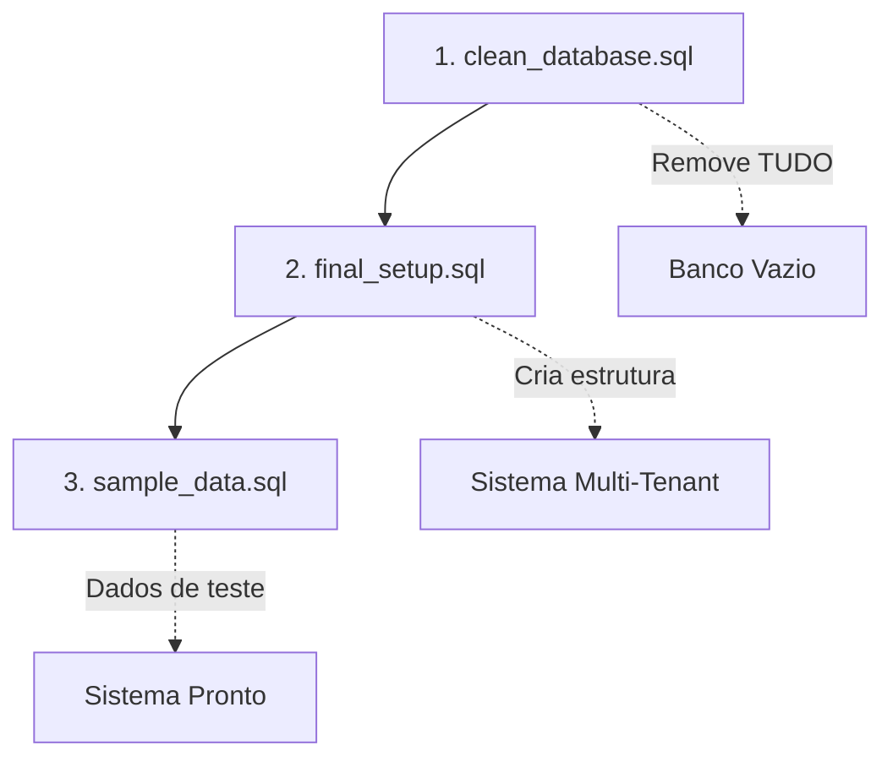

# 🚀 Guia Rápido: Zerar e Recriar Banco Supabase

## ✅ Status Atual

### Executados com Sucesso:
- ✅ clean_database.sql - Limpeza completa do banco
- ✅ final_setup.sql - Setup completo multi-tenant  
- ⏳ Próximo: sample_data.sql
- ⏳ Próximo: verify_setup.sql

### Como Continuar:
1. Execute `sample_data.sql` no SQL Editor do Supabase
2. Execute `sales_system.sql` para sistema de vendas (NOVO!)
3. Crie os usuários de teste via Authentication > Users (ver USUARIOS-TESTE.md)
4. Execute `verify_setup.sql` para confirmar que tudo está funcionando
5. Teste a aplicação Next.js com os dados de exemplo

## ⚡ Execução Passo a Passo

### 1. 🧹 LIMPAR TUDO (Reset Completo) ✅ COMPLETO
```bash
# Abra o Supabase Dashboard
# 1. Vá para: https://supabase.com/dashboard
# 2. Selecione seu projeto FVStudios Dashboard
# 3. Clique em "SQL Editor" no menu lateral
# 4. Cole o script abaixo e execute:
```

**Execute este script primeiro:** `scripts/clean_database.sql` ✅ EXECUTADO

✅ **O que foi feito:**
- Removeu todas as políticas RLS
- Removeu todos os triggers
- Removeu todas as funções
- Removeu todas as tabelas (antigas e novas)
- Removeu tipos ENUM
- Limpou completamente o banco

---

### 2. 🏗️ CRIAR NOVA ESTRUTURA ✅ COMPLETO
**Execute este script logo após:** `scripts/final_setup.sql` ✅ EXECUTADO

✅ **O que foi criado:**
- 8 tabelas multi-tenant
- 20+ políticas RLS
- Funções automáticas
- Triggers de atualização
- 6 planos de assinatura
- Sistema completo de isolamento

---

### 3. 📊 POPULAR COM DADOS DE TESTE
**Execute por último:** `scripts/sample_data.sql`

✅ **Dados criados:**
- 3 agências de exemplo
- 12 usuários com diferentes roles
- 7 projetos/campanhas
- Métricas de performance
- Eventos e notificações
- Templates de relatório

---

### 4. 👥 CRIAR USUÁRIOS DE AUTENTICAÇÃO
**Importante:** Após executar `sample_data.sql`, você precisa criar os usuários no Supabase Auth.

📋 **Como fazer:**
1. Abra: **Authentication > Users** no Supabase Dashboard
2. Para cada usuário em `USUARIOS-TESTE.md`, clique **"Add user"**
3. Use emails/senhas do arquivo (padrão: `nomedousuario123`)

🎯 **Usuários principais para teste:**
- **Admin:** admin@fvstudios.com / admin123
- **Agency Owner:** owner@fvstudios.com / joao123  
- **Cliente:** contato@empresaabc.com / roberto123

**DICA:** O trigger automático vai criar os perfis em `user_profiles` quando você adicionar no Auth!

---

### 5. 💰 SISTEMA DE VENDAS (NOVO!)
**Execute também:** `scripts/sales_system.sql`

🎯 **Sistema completo de vendas para agências:**
- Landing page: `/agency-signup`
- Cadastro automático pós-pagamento
- Sistema de cupons de desconto
- Onboarding guiado
- Dashboard administrativo de vendas

📖 **Documentação completa:** `SISTEMA-VENDAS.md`
- Eventos de calendário
- Notificações

---

## 🎯 Ordem de Execução



## ✅ Verificação Final

Após executar os 3 scripts, você deve ter:

### Tabelas Criadas (8)
- ✅ agencies
- ✅ user_profiles  
- ✅ client_api_configs
- ✅ projects
- ✅ project_metrics
- ✅ events
- ✅ notifications
- ✅ plan_limits

### Dados de Teste
- ✅ 3 agências configuradas
- ✅ 12 usuários com senhas simples
- ✅ Projetos distribuídos por tipo de plano
- ✅ Métricas de exemplo
- ✅ Eventos de calendário

### Segurança Ativa
- ✅ RLS habilitado em todas as tabelas
- ✅ Isolamento entre agências funcionando
- ✅ Permissões por role implementadas

---

## 🔐 Usuários de Teste Criados

| Email | Senha | Role | Agência |
|-------|-------|------|---------|
| admin@fvstudios.com | admin123 | admin | - |
| marcos@agenciacriar.com | marcos123 | agency_owner | Criar Marketing |
| julia@agenciacriar.com | julia123 | agency_staff | Criar Marketing |
| cliente1@loja.com | cliente123 | client | Criar Marketing |
| fernanda@fvstudios.com | fernanda123 | client | - |

## 🚨 Importante

1. **Backup**: Faça backup se tiver dados importantes
2. **Ordem**: Execute na ordem correta (clean → setup → data)
3. **Tempo**: Cada script demora ~30 segundos
4. **Erros**: Se der erro, execute o clean novamente
5. **Produção**: Não execute o clean em produção!

---

## 📱 Teste Rápido

Após executar tudo:

1. **Faça login** com qualquer usuário de teste
2. **Verifique** se o dashboard carrega
3. **Teste** criação de projetos/eventos
4. **Confirme** que RLS está funcionando

**✅ Se tudo funcionar, o banco está 100% pronto!**
